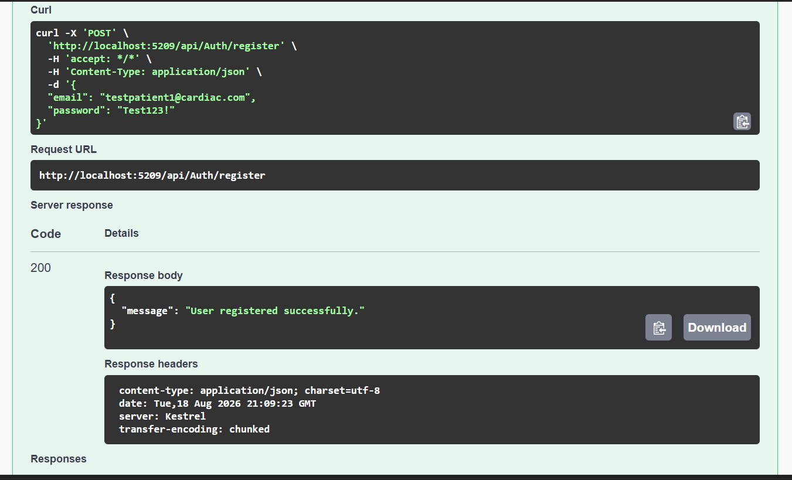
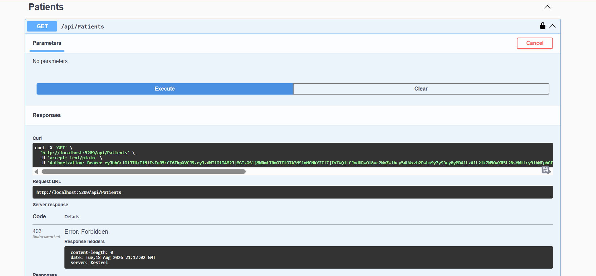
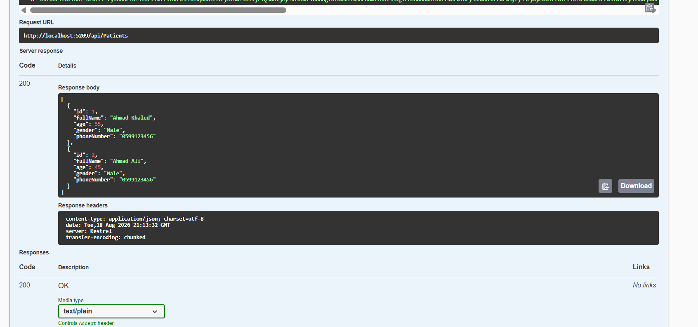
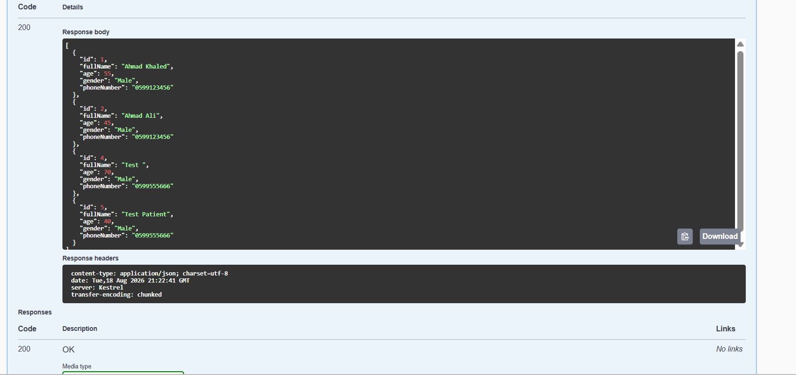
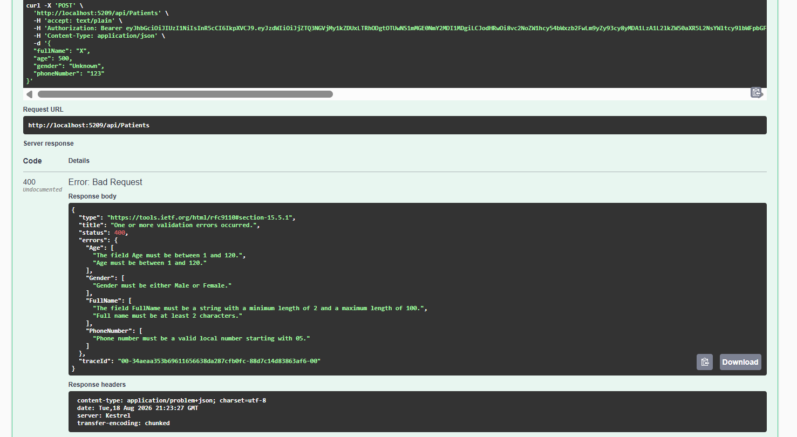
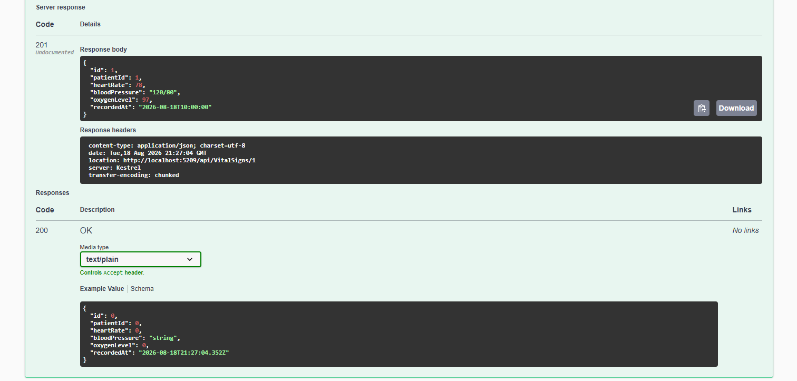
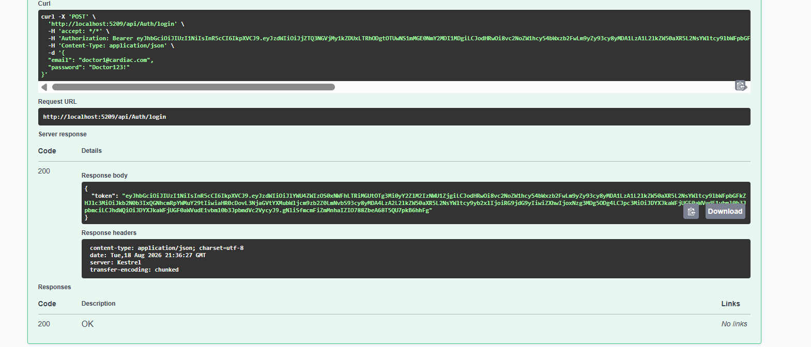
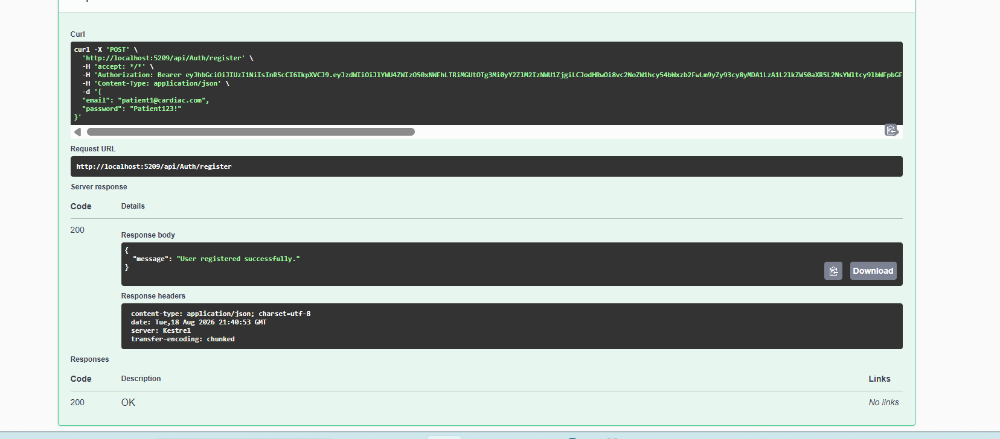
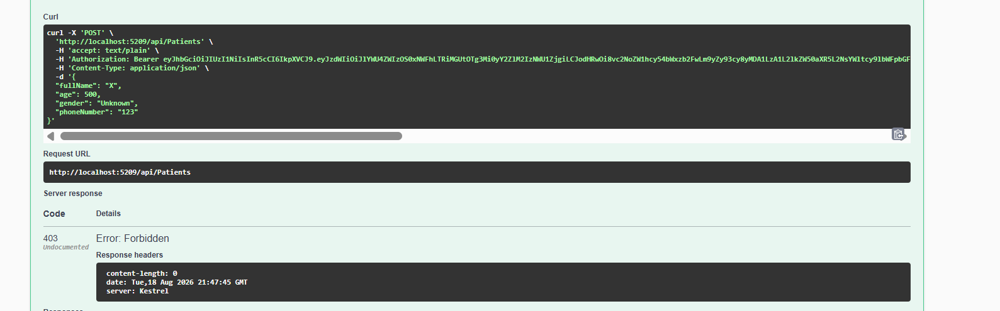

# Cardiac Patient Monitoring System

A REST API for managing cardiac patients, vital signs, medications, and appointments.

The project is built using **ASP.NET Core, Entity Framework Core, and SQL Server LocalDB**.

## Technologies

* ASP.NET Core Web API
* Entity Framework Core
* SQL Server LocalDB
* ASP.NET Core Identity
* JWT Authentication
* FluentValidation
* Swagger / OpenAPI
* CORS
* Rate Limiting

## Main Features

* Patient, Vital Sign, Medication, and Appointment management
* JWT authentication and role-based authorization
* Three roles: **Admin, Doctor, Patient**
* DTOs for API requests and responses
* FluentValidation for input validation
* Login rate limiting
* Database migrations and seed data
* Swagger for API testing

## Getting Started

Restore the packages:

```bash
dotnet restore
```

Apply the database migrations:

```bash
dotnet ef database update
```

Run the project:

```bash
dotnet run
```

Swagger is available automatically in Development mode.

## Authentication & Roles

The API uses **ASP.NET Core Identity + JWT**.

A default Admin account is seeded:

```text
Email: admin@cardiac.com
Password: Admin123!
```

* **Admin:** Full access, including managing patients and deleting records.
* **Doctor:** Can manage vital signs, medications, and appointments.
* **Patient:** Can view their permitted healthcare data.

New users registered through the normal registration endpoint are assigned the **Patient** role automatically.

Doctor accounts can only be created by an Admin.

### Patient Registration

A new account is registered through the normal registration endpoint and is automatically assigned the Patient role.



### Admin Login

The seeded Admin account is used to log in and receive a JWT token.


### JWT Authorization

The returned JWT token is added through Swagger's **Authorize** button and is then used for protected requests.


## Roles & Permissions by Module

| Module       | GET all / GET by id    | POST          | PUT           | DELETE |
| ------------ | ---------------------- | ------------- | ------------- | ------ |
| Patients     | Admin, Doctor          | Admin         | Admin         | Admin  |
| VitalSigns   | Admin, Doctor, Patient | Admin, Doctor | Admin, Doctor | Admin  |
| Medications  | Admin, Doctor, Patient | Admin, Doctor | Admin, Doctor | Admin  |
| Appointments | Admin, Doctor, Patient | Admin, Doctor | Admin, Doctor | Admin  |

### Authorization Testing

Accessing the Patients endpoint without the required authorization is rejected.



After authorizing as Admin, the same request succeeds and returns the seeded patients.



## Patient CRUD

### Create Patient

An Admin can create a new patient successfully.


### Update Patient

The created patient can be updated by an Admin.


### Delete Patient

An Admin can delete the patient.


### Verify Delete

Fetching the deleted patient returns `404 Not Found`, confirming that the delete operation was successful.



## Validation & Security

Create and Update requests are validated using **FluentValidation**.

Examples include:

* Invalid age
* Invalid phone number
* Invalid heart rate
* Invalid gender
* Past appointment date

Invalid input returns a structured `400 Bad Request` response with the validation errors.



### Login Rate Limiting

The login endpoint is protected with rate limiting.

After **5 attempts per minute**, additional login attempts return:

`429 Too Many Requests`


## Vital Signs

### Create Vital Sign

Admin and Doctor users can create vital sign records.



### Get Vital Signs

Vital sign records can be retrieved through the GET endpoint.


### Vital Sign Validation

An invalid heart rate is rejected by FluentValidation.


## Medications

Admin and Doctor users can create medication records.


## Appointments

Admin and Doctor users can create appointments.

A future appointment date is accepted successfully.


## Doctor Role

An Admin can create a Doctor account through the `create-doctor` endpoint.


The new Doctor account can then log in and receive its own JWT token.



## Patient Role Testing

A second account is registered normally and is assigned the Patient role automatically.



The Patient then attempts a restricted operation and receives `403 Forbidden`.


## Doctor Authorization Testing

The Doctor attempts to create a Patient, but this operation is restricted to Admin users.

The API correctly returns `403 Forbidden`, confirming that the role boundaries are enforced.



## Project Structure

```text
CardiacPatientMonitoring/
├── Controllers/
├── Models/
├── DTOs/
├── Validators/
├── Data/
├── Migrations/
├── Program.cs
├── appsettings.json
└── README.md
```

## Summary

This project demonstrates a structured ASP.NET Core backend with:

* Async CRUD operations
* EF Core and SQL Server
* Identity and JWT authentication
* Role-based authorization
* FluentValidation
* Rate limiting
* Swagger API testing
* Database migrations and seed data
