# Cardiac Patient Monitoring System

A REST API for managing cardiac patients, vital signs, medications, and appointments.

The project is built using **ASP.NET Core, Entity Framework Core, and SQL Server LocalDB**.

## Technologies

* ASP.NET Core Web API
* Entity Framework Core
* SQL Server LocalDB
* ASP.NET Core Identity
* JWT Authentication
* FluentValidation
* xUnit
* Moq
* WebApplicationFactory
* Swagger / OpenAPI
* CORS
* Rate Limiting

## Main Features

* Patient, Vital Sign, Medication, and Appointment management
* JWT authentication and role-based authorization
* Three roles: **Admin, Doctor, Patient**
* DTOs for API requests and responses
* FluentValidation for input validation
* Login rate limiting
* Database migrations and seed data
* Swagger for API testing
* Automated unit, mocking, and integration tests
* Centralized error handling with ProblemDetails

## Getting Started

Restore the packages:

```bash
dotnet restore
```

Apply the database migrations:

```bash
dotnet ef database update
```

Run the project:

```bash
dotnet run
```

Swagger is available automatically in Development mode.

## Authentication & Roles

The API uses **ASP.NET Core Identity + JWT**.

A default Admin account is seeded:

```text
Email: admin@cardiac.com
Password: Admin123!
```

* **Admin:** Full access, including managing patients and deleting records.
* **Doctor:** Can manage vital signs, medications, and appointments.
* **Patient:** Can view their permitted healthcare data.

New users registered through the normal registration endpoint are assigned the **Patient** role automatically.

Doctor accounts can only be created by an Admin.

### Patient Registration

A new account is registered through the normal registration endpoint and is automatically assigned the Patient role.


### Admin Login

The seeded Admin account is used to log in and receive a JWT token.

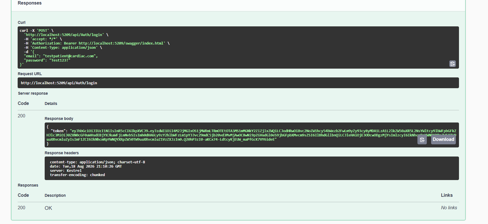

### JWT Authorization

The returned JWT token is added through Swagger's **Authorize** button and is then used for protected requests.

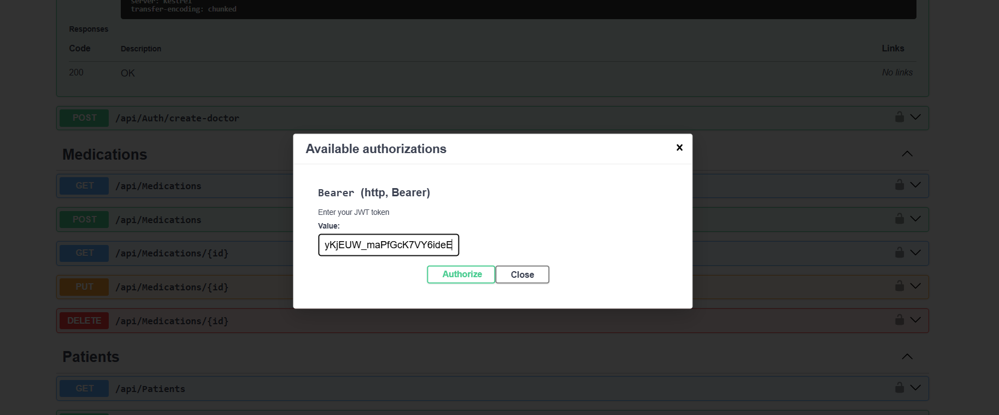

## Roles & Permissions by Module

| Module | GET all / GET by id | POST | PUT | DELETE |
|---|---|---|---|---|
| Patients | Admin, Doctor | Admin | Admin | Admin |
| VitalSigns | Admin, Doctor, Patient | Admin, Doctor | Admin, Doctor | Admin |
| Medications | Admin, Doctor, Patient | Admin, Doctor | Admin, Doctor | Admin |
| Appointments | Admin, Doctor, Patient | Admin, Doctor | Admin, Doctor | Admin |

## Validation & Security

Create and Update requests are validated using FluentValidation.
Invalid data, such as an invalid age, phone number, heart rate, or past appointment date, returns a structured `400 Bad Request`.

The login endpoint is also protected with rate limiting. After 5 attempts per minute, additional requests return `429 Too Many Requests`.

## Testing

The API was tested through Swagger using Admin, Doctor, and Patient accounts.
The testing covered:

* Authentication and JWT tokens
* Role-based authorization
* CRUD operations
* Validation errors
* `401` and `403` authorization responses
* `404` for missing resources
* Login rate limiting with `429`
* Different permissions for Admin, Doctor, and Patient

The database is also seeded with sample patients, vital signs, medications, and appointments for testing.

### Testing Walkthrough

Registering a new account confirms it defaults to the Patient role.


Logging in as the seeded Admin account returns a JWT token.


That token is used to authorize all further requests through the Swagger Authorize button.


Testing role restrictions on Patients, an unauthenticated or wrong-role request to GET patients correctly returns `403`.


Once authorized as Admin, the same request succeeds with a `200` and returns the seeded patients.


Creating a new patient as Admin succeeds with a `201`.

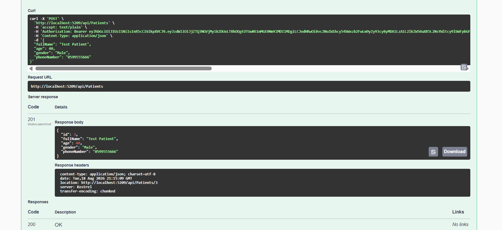

Updating that same patient returns a `204`.

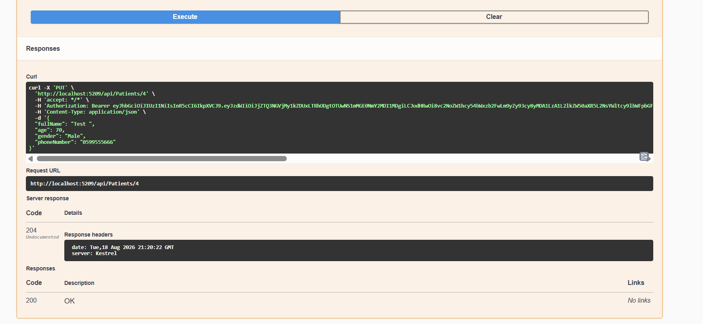

Deleting the patient also returns a `204`.

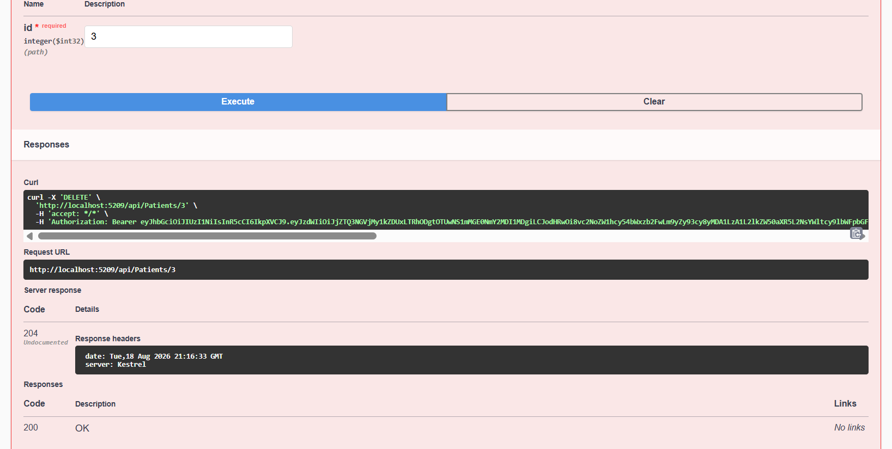

Fetching the deleted patient afterward correctly returns a `404`, confirming the delete actually took effect.


Sending intentionally invalid data, such as an age outside the allowed range or an invalid gender value, triggers FluentValidation and returns a structured `400` with a clear message for each failing field.


### Login Rate Limiting

The login endpoint is protected with rate limiting.

After **5 attempts per minute**, additional login attempts return:

`429 Too Many Requests`

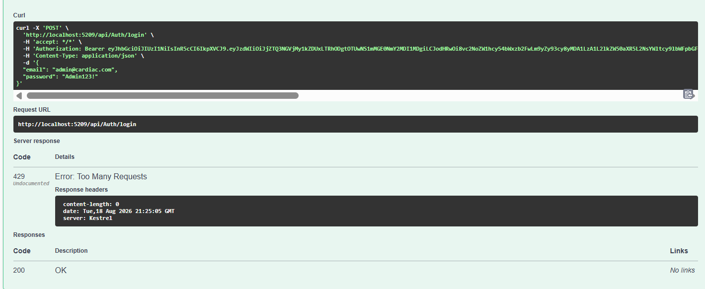

## Vital Signs

### Create Vital Sign

Admin and Doctor users can create vital sign records.


### Get Vital Signs

Vital sign records can be retrieved through the GET endpoint.

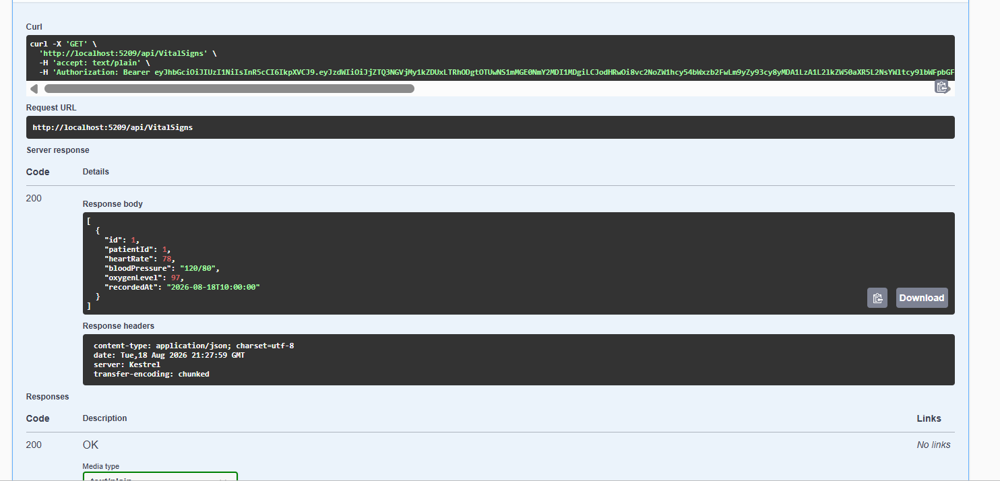

### Vital Sign Validation

An invalid heart rate is rejected by FluentValidation.

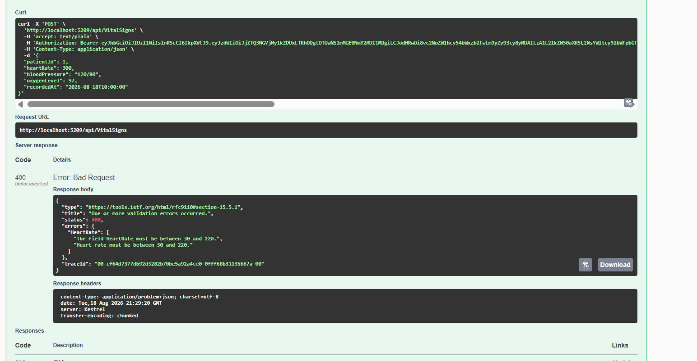

## Medications

Admin and Doctor users can create medication records.

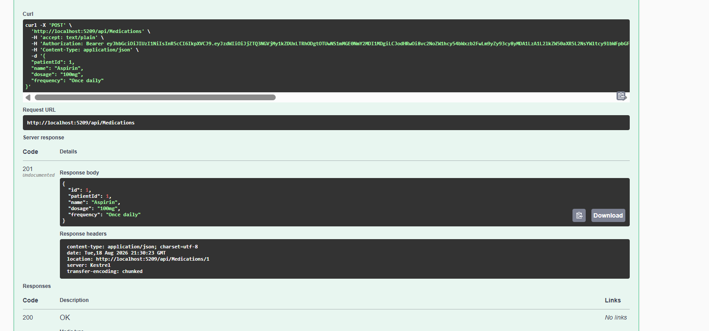

## Appointments

Admin and Doctor users can create appointments.

A future appointment date is accepted successfully.

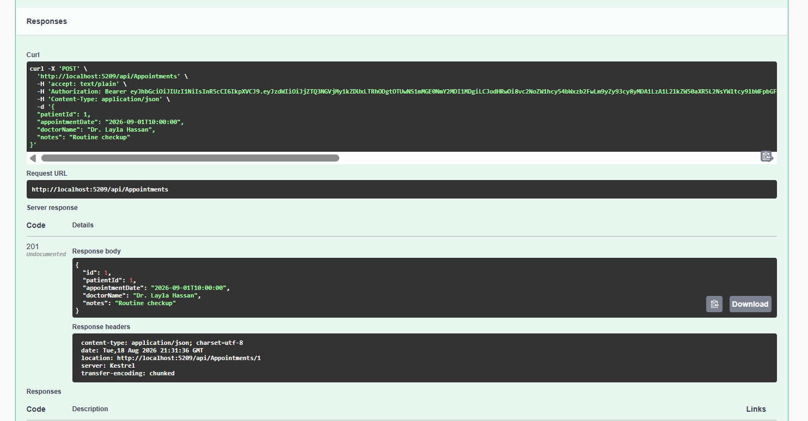

## Doctor Role

An Admin can create a Doctor account through the `create-doctor` endpoint.

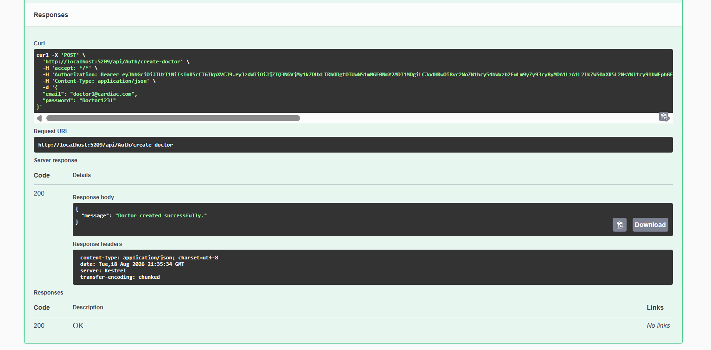

The new Doctor account can then log in and receive its own JWT token.


## Patient Role Testing

A second account is registered normally and is assigned the Patient role automatically.


The Patient then attempts a restricted operation and receives `403 Forbidden`.

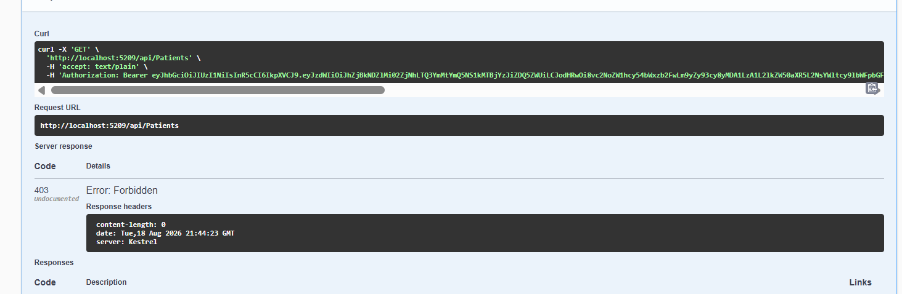

## Doctor Authorization Testing

The Doctor attempts to create a Patient, but this operation is restricted to Admin users.

The API correctly returns `403 Forbidden`, confirming that the role boundaries are enforced.


## Project Structure

```text
CardiacPatientMonitoring/

├── Controllers/
├── Models/
├── DTOs/
├── Validators/
├── Data/
├── Migrations/
├── Program.cs
├── appsettings.json
└── README.md
```

## Summary

This project demonstrates building a secure and structured healthcare REST API using ASP.NET Core, with database management through EF Core, authentication using JWT, role-based authorization, validation, and API testing through Swagger.