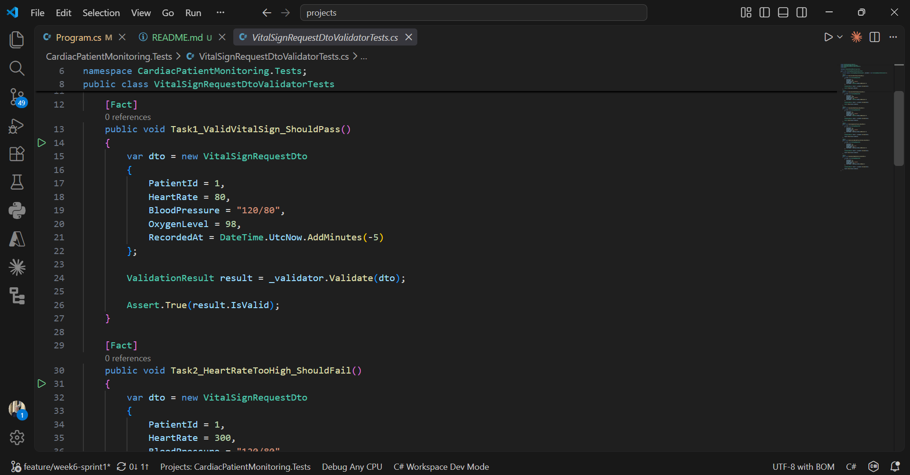
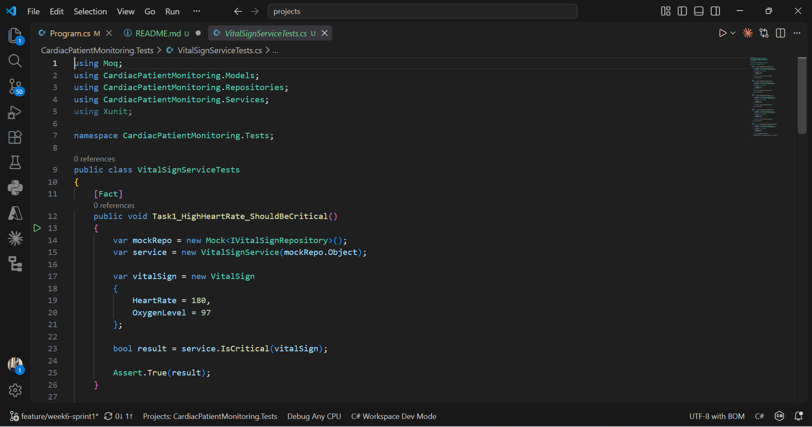
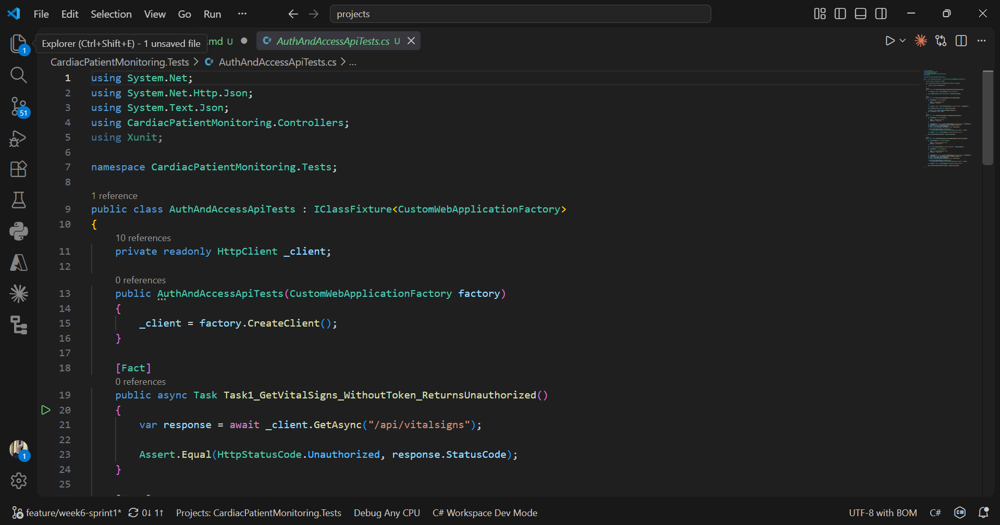
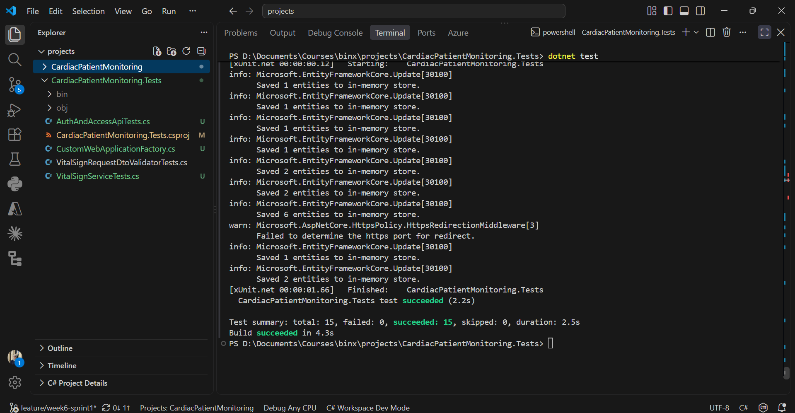
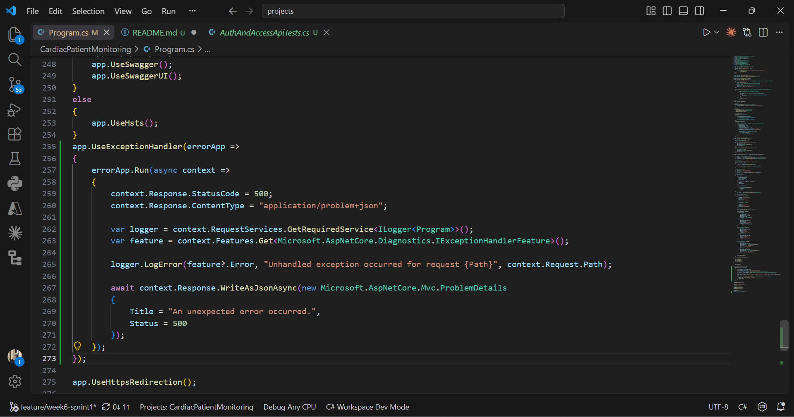

# Cardiac Patient Monitoring System

A REST API for managing cardiac patients, vital signs, medications, and appointments.

The project is built using **ASP.NET Core, Entity Framework Core, and SQL Server LocalDB**.

## Technologies

* ASP.NET Core Web API
* Entity Framework Core
* SQL Server LocalDB
* ASP.NET Core Identity
* JWT Authentication
* FluentValidation
* xUnit
* Moq
* WebApplicationFactory
* Swagger / OpenAPI
* CORS
* Rate Limiting

## Main Features

* Patient, Vital Sign, Medication, and Appointment management
* JWT authentication and role-based authorization
* Three roles: **Admin, Doctor, Patient**
* DTOs for API requests and responses
* FluentValidation for input validation
* Login rate limiting
* Database migrations and seed data
* Swagger for API testing
* Automated unit, mocking, and integration tests
* Centralized error handling with `ProblemDetails`

## Getting Started

### 1. Restore the packages

```bash
dotnet restore
```

### 2. Apply the database migrations

```bash
dotnet ef database update
```

### 3. Run the project

```bash
dotnet run
```

Swagger is available automatically in Development mode.

## Authentication & Roles

The API uses **ASP.NET Core Identity + JWT**.

A default Admin account is seeded:

```text
Email: admin@cardiac.com
Password: Admin123!
```

### Roles

* **Admin** — Full access, including managing patients and deleting records.
* **Doctor** — Can manage vital signs, medications, and appointments.
* **Patient** — Can view their permitted healthcare data.

New users registered through the normal registration endpoint are automatically assigned the **Patient** role.

Doctor accounts can only be created by an **Admin**.

## Roles & Permissions by Module

| Module       | GET All / GET by ID    | POST          | PUT           | DELETE |
| ------------ | ---------------------- | ------------- | ------------- | ------ |
| Patients     | Admin, Doctor          | Admin         | Admin         | Admin  |
| Vital Signs  | Admin, Doctor, Patient | Admin, Doctor | Admin, Doctor | Admin  |
| Medications  | Admin, Doctor, Patient | Admin, Doctor | Admin, Doctor | Admin  |
| Appointments | Admin, Doctor, Patient | Admin, Doctor | Admin, Doctor | Admin  |

## Validation & Security

Create and Update requests are validated using **FluentValidation**.

Invalid data, such as:

* Invalid age
* Invalid phone number
* Invalid heart rate
* Past appointment date

returns a structured `400 Bad Request` response.

The login endpoint is also protected with **rate limiting**.

After 5 login attempts within one minute, additional requests return:

```text
429 Too Many Requests
```

## API Testing

The API was tested through Swagger using **Admin, Doctor, and Patient** accounts.

The testing covered:

* Authentication and JWT tokens
* Role-based authorization
* CRUD operations
* Validation errors
* `401 Unauthorized`
* `403 Forbidden`
* `404 Not Found`
* `429 Too Many Requests`
* Different permissions for Admin, Doctor, and Patient

The database is also seeded with sample patients, vital signs, medications, and appointments for testing.

## Testing Walkthrough

### 1. Patient Registration

Registering a new account confirms that it defaults to the **Patient** role.


### 2. Admin Login

Logging in as the seeded Admin account returns a JWT token.


### 3. Swagger Authorization

The JWT token is used to authorize further requests through the Swagger **Authorize** button.


### 4. Patient Access Restriction

An unauthenticated or wrong-role request to `GET /api/patients` correctly returns `403 Forbidden`.


### 5. Admin Access

Once authorized as Admin, the same request succeeds with `200 OK` and returns the seeded patients.


### 6. Create Patient

Creating a new patient as Admin succeeds with `201 Created`.


### 7. Update Patient

Updating the same patient returns `204 No Content`.


### 8. Delete Patient

Deleting the patient returns `204 No Content`.


### 9. Verify Deleted Patient

Fetching the deleted patient afterward correctly returns `404 Not Found`, confirming that the delete operation took effect.


### 10. FluentValidation

Sending intentionally invalid data, such as an age outside the allowed range or an invalid gender value, triggers FluentValidation and returns a structured `400 Bad Request` response with a clear message for each failing field.


### 11. Login Rate Limiting

Sending repeated login requests quickly triggers the rate limiter and returns `429 Too Many Requests` after the fifth attempt within one minute.


## Vital Signs Testing

The same CRUD pattern was verified across the other modules.

### Create Vital Sign

Creating a vital sign record succeeds as expected.


### Get Vital Signs

Fetching all vital sign records confirms that the new record is present.


### Vital Sign Validation

Sending a heart rate outside the valid range correctly triggers a validation error.


## Medication Testing

Creating a medication record succeeds as expected.


## Appointment Testing

Creating an appointment with a future date succeeds as expected.


## Doctor & Patient Role Testing

### Create Doctor Account

An Admin account was used to create a Doctor account through the create-doctor endpoint.


### Doctor Login

The Doctor account was then used to log in and obtain its own JWT token.


### Patient Registration

A second account was registered normally to represent a Patient.


### Patient Authorization

Logging in as that Patient and attempting a restricted action correctly returns `403 Forbidden`.


### Doctor Authorization

Logging in as the Doctor and attempting to create a patient, an action reserved for Admin only, also correctly returns `403 Forbidden`.

This confirms that the role boundaries between **Admin, Doctor, and Patient** are enforced as intended.


## Automated Testing

The project includes automated tests using:

* **xUnit**
* **Moq**
* **WebApplicationFactory**

### Unit Tests — xUnit

Unit tests cover the VitalSign validation rules and verify both valid and invalid input scenarios.

The tests include cases such as valid heart rate values and invalid values outside the allowed range.



### Mocking — Moq

Moq is used to isolate the VitalSign service logic from external dependencies and test the service behavior independently.



### Integration Tests — WebApplicationFactory

Integration tests use `WebApplicationFactory` with an in-memory database to test the API through HTTP requests.

The tests cover authentication and authorization scenarios, including:

* Unauthenticated requests returning `401 Unauthorized`
* Successful Admin authentication
* Authorized Admin access returning `200 OK`
* Patient users being denied restricted operations with `403 Forbidden`



### Test Results

The complete automated test suite was executed using:

```bash
dotnet test
```

All tests passed successfully.



## Error Handling

Unhandled exceptions are handled centrally using ASP.NET Core's `UseExceptionHandler`.

When an unexpected exception occurs:

* The exception is caught by the centralized exception handler.
* Full exception details are logged server-side using `ILogger`.
* The client receives a standardized `ProblemDetails` response.
* Internal exception messages and stack traces are not exposed to the client.



This provides consistent and safe error responses across the API while keeping internal implementation details protected.

## Project Structure

```text
CardiacPatientMonitoring/
│
├── Controllers/
├── Models/
├── DTOs/
├── Validators/
├── Data/
├── Migrations/
├── Program.cs
├── appsettings.json
└── README.md
```

## Summary

This project demonstrates building a secure and structured healthcare REST API using **ASP.NET Core**, with:

* Database management through EF Core
* Authentication using JWT
* Role-based authorization
* Input validation with FluentValidation
* Automated testing with xUnit and Moq
* Integration testing with WebApplicationFactory
* Centralized error handling with ProblemDetails
* API testing through Swagger
* Rate limiting for login protection

The project combines these components to provide a structured, secure, and testable backend API for cardiac patient monitoring.
