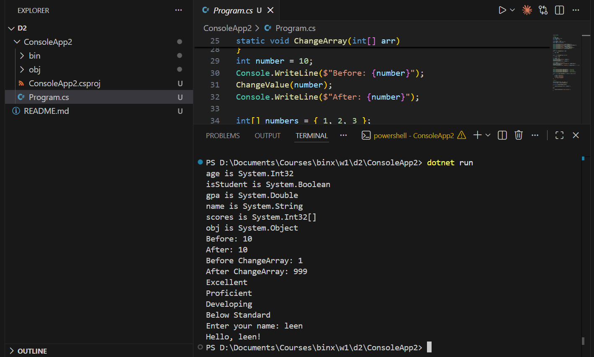

# Day 2: C# Fundamentals I: Types, Variables & Control Flow

Today I practiced value types and reference types in C#, printing each variable's type using `GetType()`.

I wrote a method to demonstrate copy behavior, showing how value types are copied independently while reference types share the same data.

I built a grade-classifier method using a switch expression, and wrote a program that safely handles possibly-null user input using nullable reference types.

I committed the day's work to GitHub with a clear commit message.

