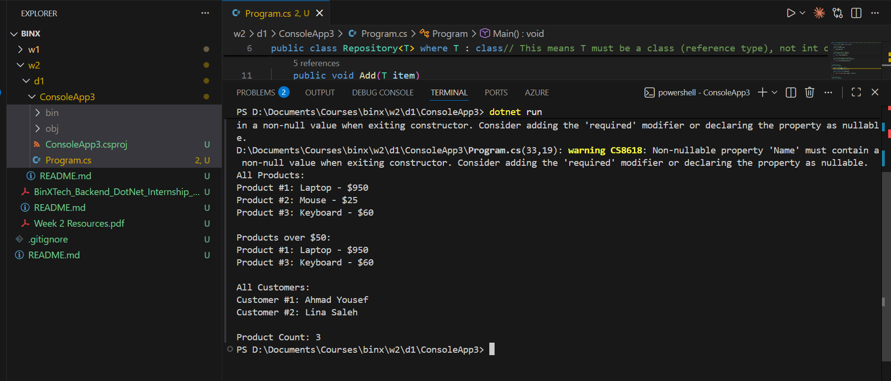

# Leen-Azzam-BinX-Backend-Internship
Week 2 - Day 1: Generics & Advanced Collections

This day covers a generic Repository<T> class constrained with where T : class, exposing Add, GetAll, and Find methods, where GetAll and Find return IReadOnlyList<T> instead of List<T> so callers can read the data but not modify it directly, and the repository is tested against two unrelated domain types, Product and Customer, to confirm the same generic implementation works safely across different types without any casting.ؤي
