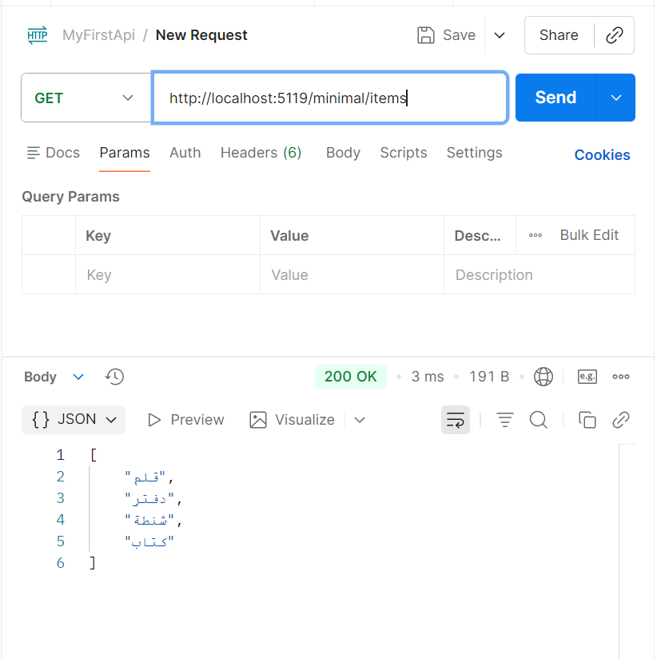
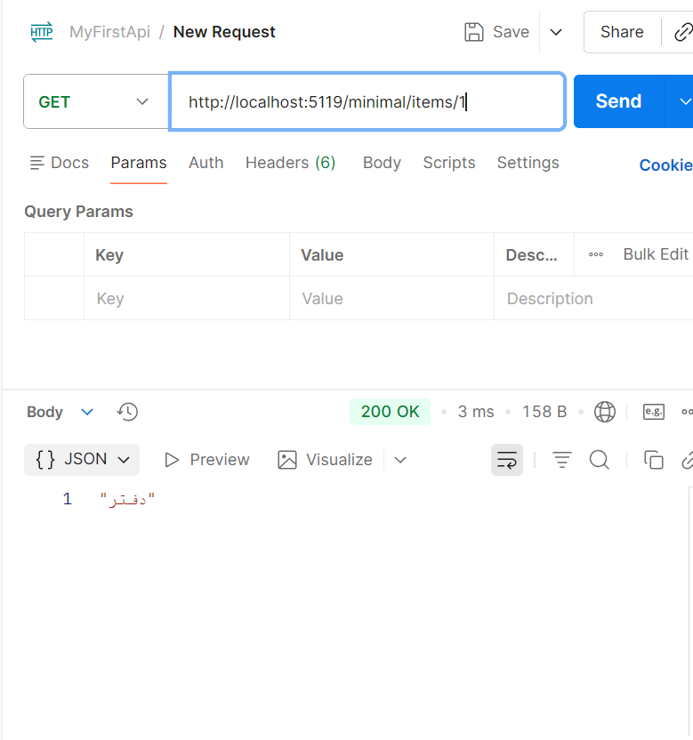
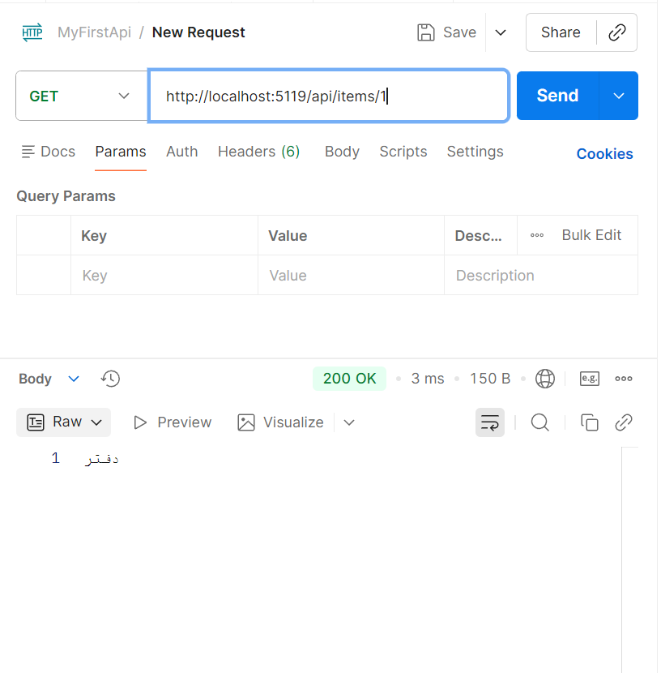

# Day 4: ASP.NET Core Project Setup & Routing

Today involved scaffolding a first ASP.NET Core Web API project (MyFirstApi) using the dotnet new webapi command, and getting familiar with the structure of Program.cs and the minimal hosting model. Four GET endpoints were built: two via a Controller (ItemsController) returning a hardcoded list of items and a single item by ID, and two with the same functionality using Minimal APIs directly in Program.cs, for comparison between the two approaches. Controllers were enabled by adding AddControllers() and MapControllers(), and all four endpoints were tested and saved as a Postman Collection.

