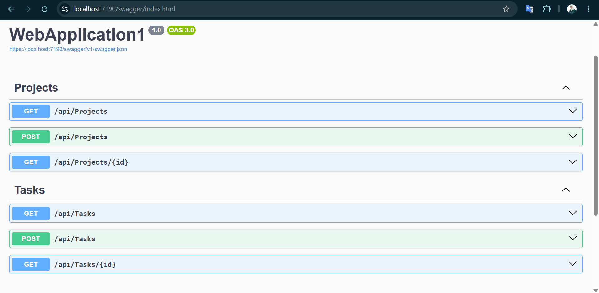

# Day 3: EF Core Setup

This project demonstrates how to integrate Entity Framework Core with an ASP.NET Core Web API. It includes entity models, a DbContext, SQL Server configuration, and the initial database migration. The database was created using EF Core migrations based on the ERD designed in Week 3 Day 2.

