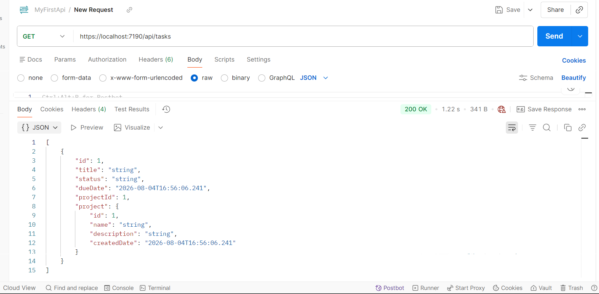
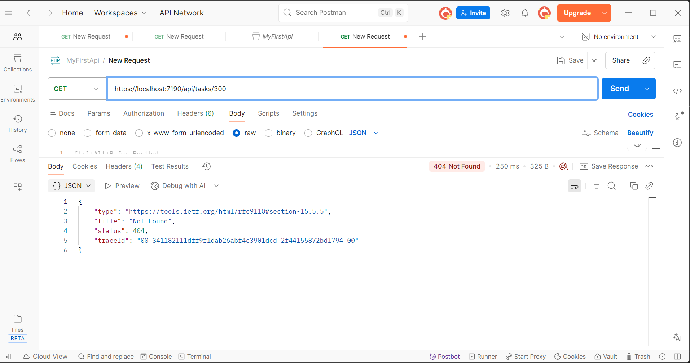
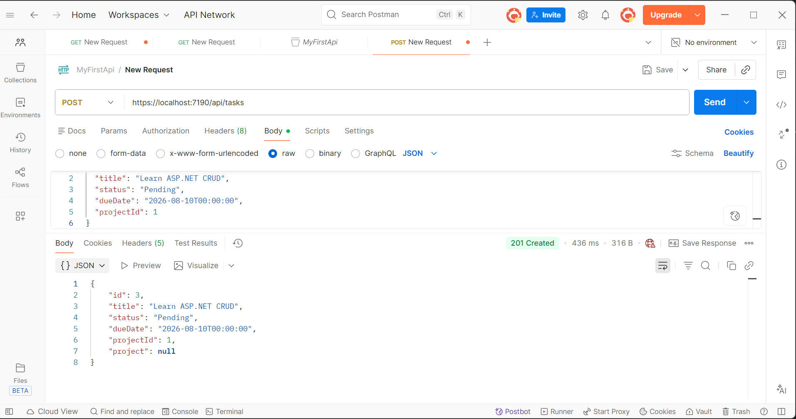
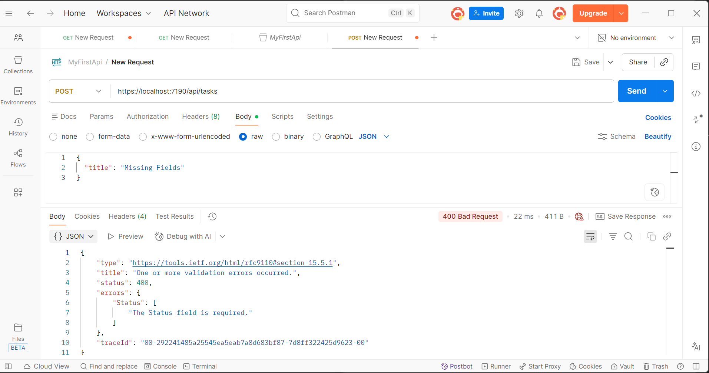
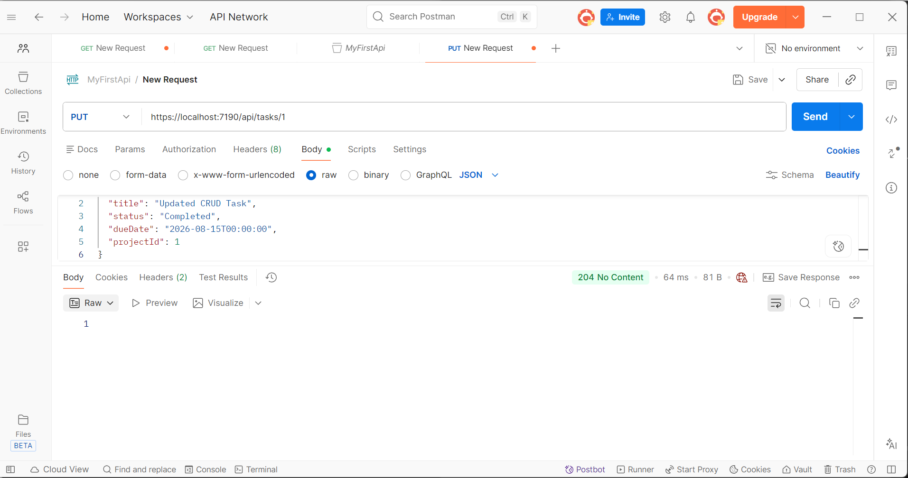
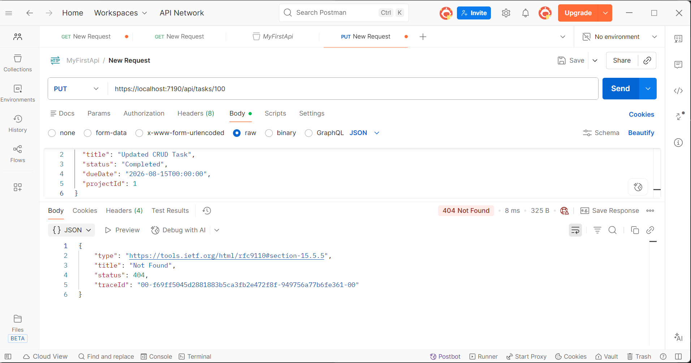
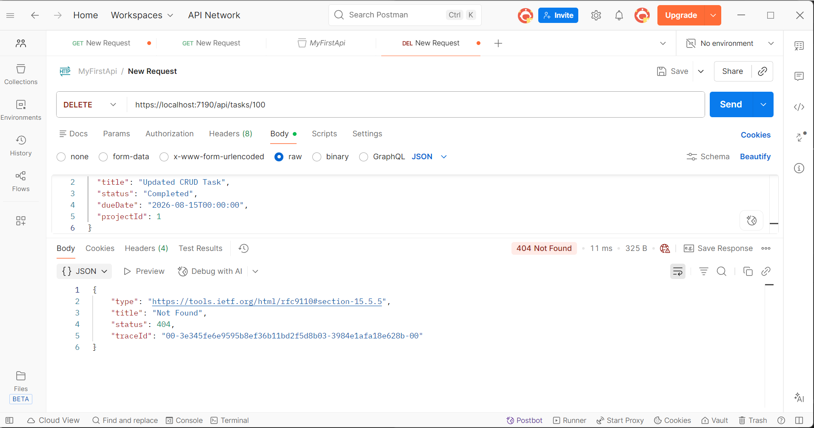

# Day 4: Full CRUD Implementation

This lab implements a complete CRUD API for the Task resource using ASP.NET Core, Entity Framework Core, and Postman. The implemented endpoints include Create, Get All, Get By Id, Update, and Delete operations.

The API handles different HTTP responses such as:
- 201 Created for successful creation
- 204 No Content for successful update and delete operations
- 400 Bad Request for invalid input
- 404 Not Found when a requested resource does not exist

All endpoints were tested using Postman, including successful requests and deliberate error cases. The screenshots below demonstrate the implemented CRUD operations and error handling.

## Screenshots

### GET All Tasks

### GET Error Case (Not Found)

### POST Create Task

### POST Error Case (Invalid Input)

### PUT Update Task

### PUT Error Case (Not Found)

### DELETE Task

### DELETE Error Case (Not Found)
