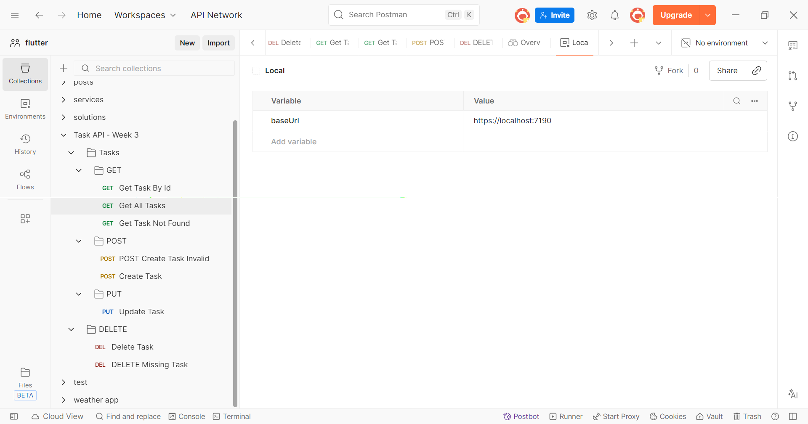

# Day 5: Testing and Documenting the API with Postman

In this lab, the API was fully tested using Postman by organizing all CRUD requests into a structured collection. Both successful and error scenarios were verified, and Postman test scripts were added to validate the expected HTTP status codes. A Postman environment with a `baseUrl` variable was created to make the collection reusable across different environments. Finally, the API was documented to provide clear and organized API testing and usage.

## Postman Collection and Environment

The following screenshot shows the organized Postman collection and the configured environment.

## Postman Test Scripts

The following screenshot shows the Postman test scripts used to validate the expected HTTP status codes automatically.

