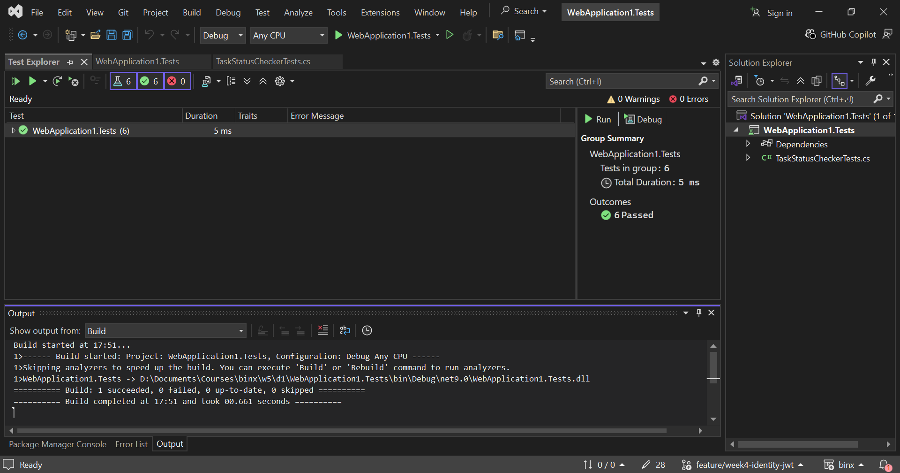

# Day 1 – Project Selection & Unit Testing

## Project Selection

The **Task & Project Management API** was selected as the Phase 3 capstone because it extends the existing Task Management API from Weeks 1–4.

The existing API already includes Projects, Tasks, Users, TaskAssignments, JWT authentication, and role-based authorization.

## Scope Statement

This project extends the existing Task & Project Management API into the Phase 3 capstone.

The API already has authentication, authorization, and an EF Core database with Projects, Tasks, Users, and TaskAssignments.

The remaining work includes TaskAssignment CRUD, Postman documentation, unit and integration tests, and deployment by Week 9.

## Unit Testing

A new xUnit project named `WebApplication1.Tests` was created and referenced the main API project.

A pure `IsOverdue` method was added to check whether a task is overdue and incomplete.

Three `[Fact]` tests were written using Arrange-Act-Assert:

* Overdue and incomplete task
* Future due date
* Completed task

A `[Theory]` test with `InlineData` was also added to cover the three cases.

## Test Result

All **6 test cases passed** successfully using:

```bash
dotnet test
```

