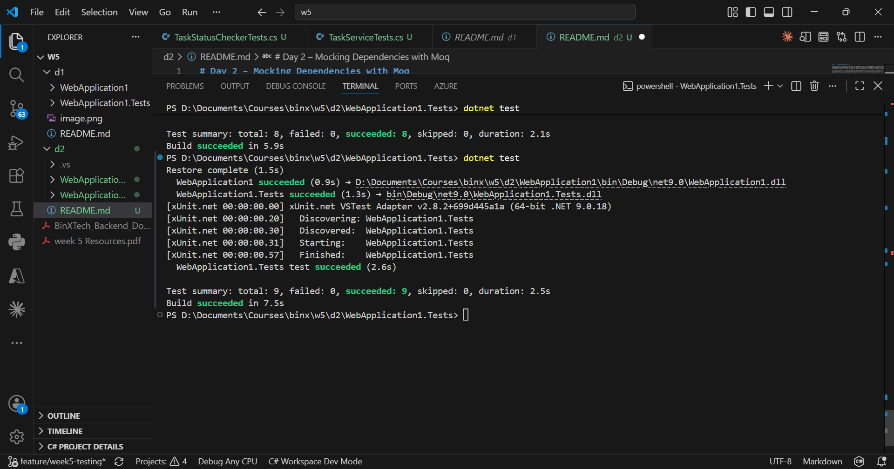

# Day 2 – Mocking Dependencies with Moq

This day focused on isolating unit tests from real dependencies using Moq. An ITaskRepository interface and its real implementation TaskRepository were added, followed by a new TaskService that depends on the interface instead of AppDbContext directly. This made it possible to mock the repository in tests instead of using a real database.

Three tests were written for TaskService.IsTaskOverdueAsync using Moq. The first test mocks the repository to return a specific task and asserts the service correctly identifies it as overdue. The second test mocks the repository to throw an exception and asserts the service does not swallow it. The third test uses Moq's Verify to confirm GetByIdAsync was called exactly once.

All 9 tests in the project passed successfully using dotnet test.

