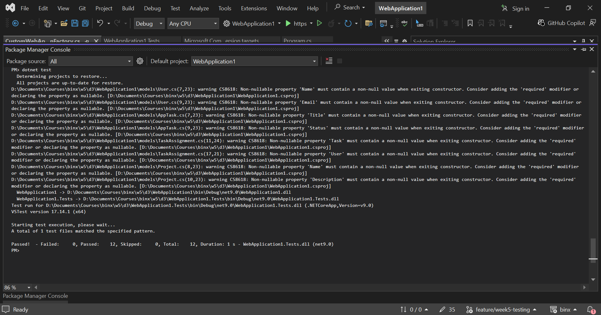

# Day 3 Lab — Integration Testing with WebApplicationFactory

Set up WebApplicationFactory to run the API in-memory, wrote integration tests against real HTTP endpoints (happy path, not-found, unauthorized), used an in-memory test database, and tested a protected endpoint with a real JWT.

**Result:** All 12 tests passed.

```
Passed!  - Failed: 0, Passed: 12, Total: 12
```

