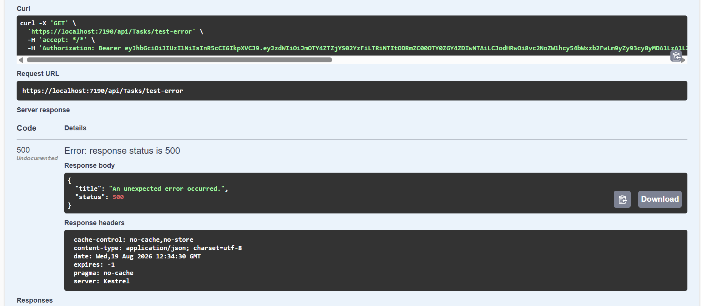
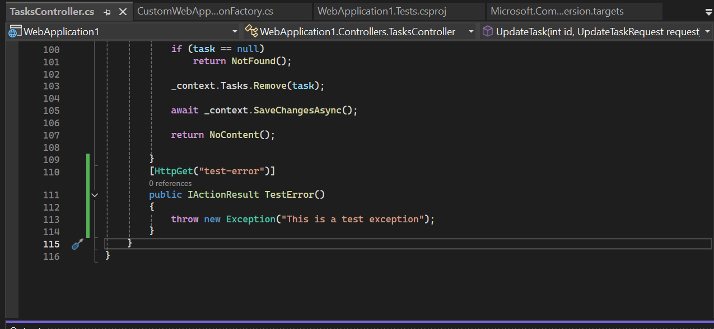

# Week 5 — Day 4: Centralized Exception Handling

Today I implemented centralized exception handling using `UseExceptionHandler` in `Program.cs`.

### What I Did

* Centralized unhandled exception handling instead of using `try-catch` in every endpoint.
* Returned a standardized `ProblemDetails` response with HTTP `500`.
* Prevented exception messages and stack traces from being exposed to clients.
* Added `ILogger` to log the full exception and request path server-side.
* Tested the handler using a temporary endpoint that intentionally threw an exception.

After verifying the response and logging, I removed the test endpoint and cleaned up unnecessary `try-catch` blocks from the controllers.

