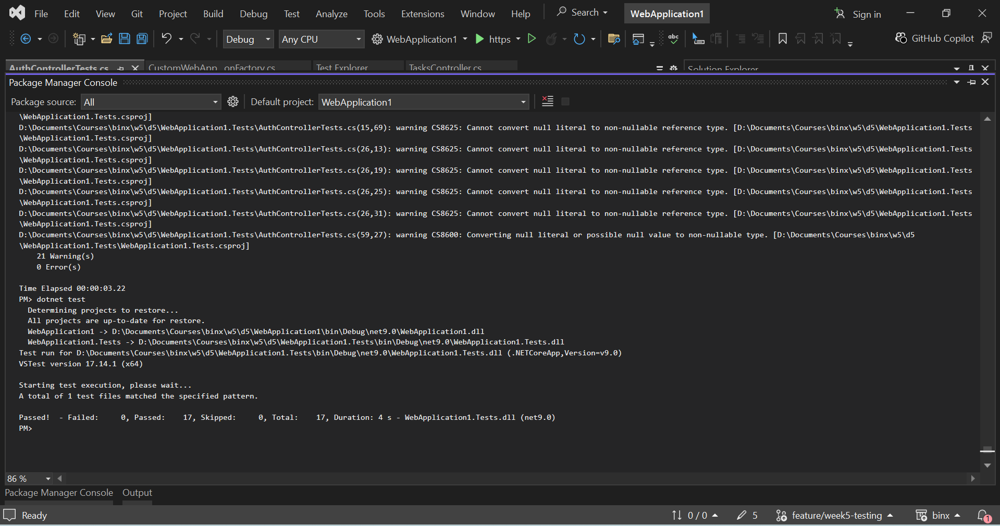
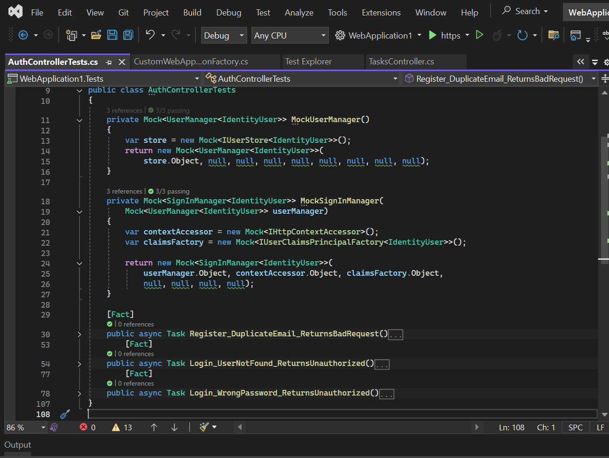
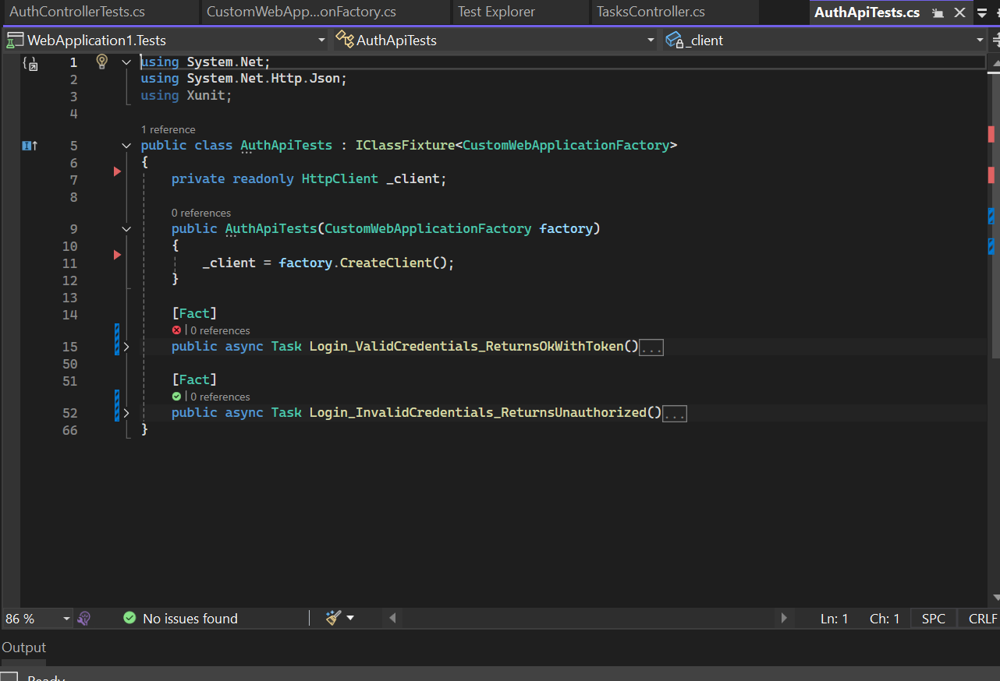

# Day 5 — Testing & Week 5 Wrap-up

Today I applied the testing practices to the project and completed the Week 5 testing setup.

### Testing

* Added **unit tests** using xUnit and Moq for important authentication scenarios.
* Added **integration tests** using `WebApplicationFactory`.
* Used an **In-Memory database** for integration testing.
* Configured `User` and `Admin` roles in the test environment.
* Tested successful and failed login scenarios.
* Ran the full test suite using `dotnet test`.

### Test Result

```text
Total: 17
Passed: 17
Failed: 0
Skipped: 0
```

### Week 5 Completion

Week 5 testing and error-handling requirements are completed. The project is ready for **Phase 3 — Sprint 1**.

### Screenshots






