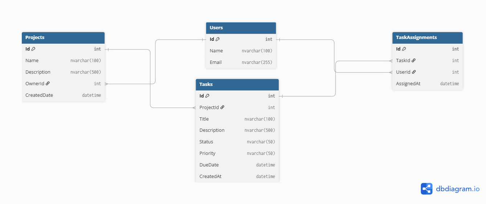

# Week 6 — Day 1: Sprint 1 Planning & Database Design

This is Day 1 of Sprint 1, the first week of Phase 3 for the Task and Project Management API capstone.

The goal of the sprint was planned around designing and implementing the complete database schema, building the core read endpoints for projects and tasks, and creating a task endpoint with real business logic.

## Domain Design

The full domain was mapped around four main entities:

* **Projects**
* **Tasks**
* **Users**
* **TaskAssignments**

`TaskAssignments` works as a join table to manage the many-to-many relationship between tasks and users.

The database schema was reviewed against normalization principles, including **1NF** and **3NF**, to keep the data structure organized and avoid unnecessary duplication.

## ERD

The relationships between the entities were documented using an Entity Relationship Diagram (ERD) created with dbdiagram.io.

## Sprint Planning

The Sprint 1 backlog was divided into seven tasks covering:

* Entity implementation
* Fluent API configuration
* Database migrations
* Project read endpoints
* Task read endpoints
* Task creation with business logic
* Opening a Pull Request

Each task was estimated between half a day and one full day to keep the sprint organized and achievable.

## Day 1 Outcome

Day 1 focused on planning and design before starting implementation. By the end of the day, the database structure, entity relationships, ERD, and Sprint 1 backlog were clearly defined and ready for development.
    