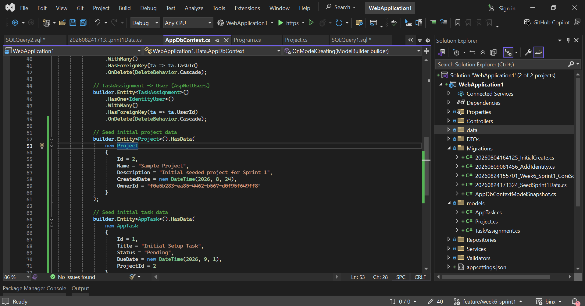
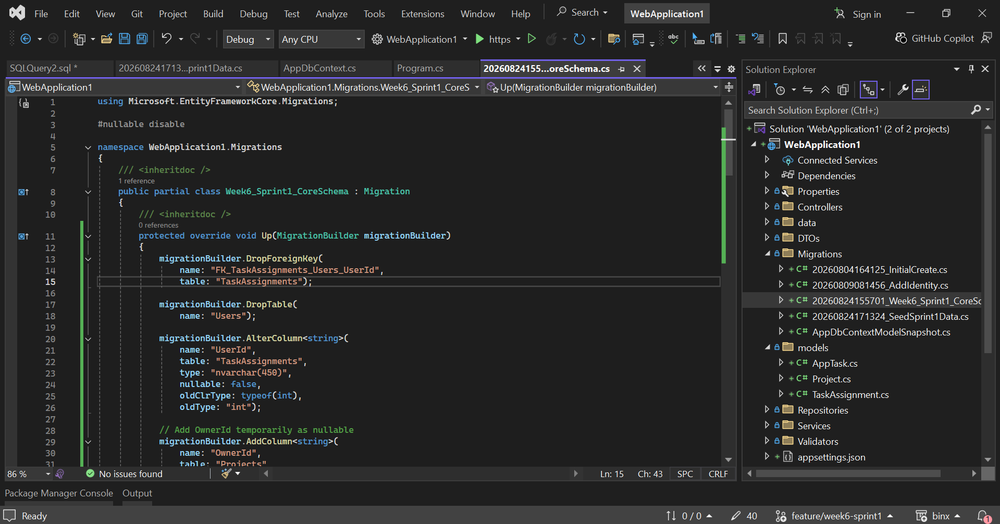
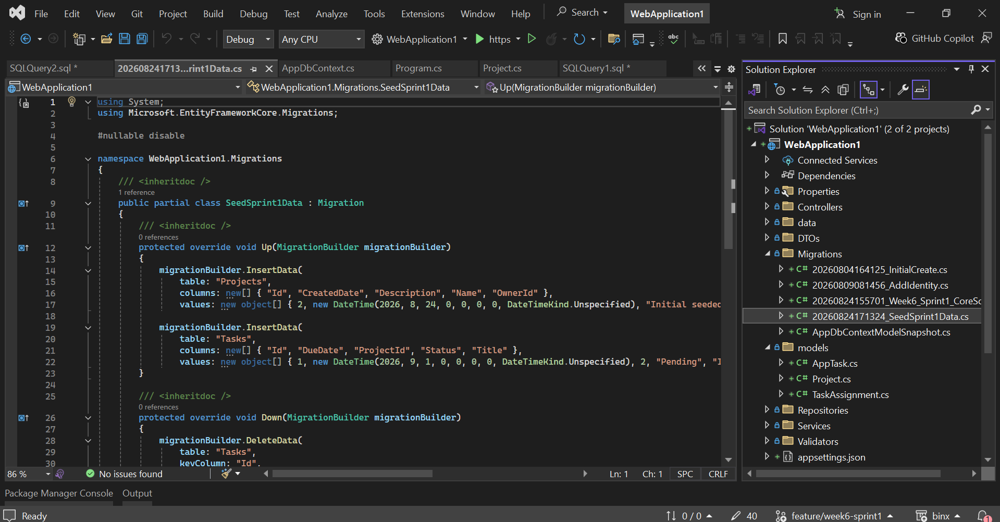
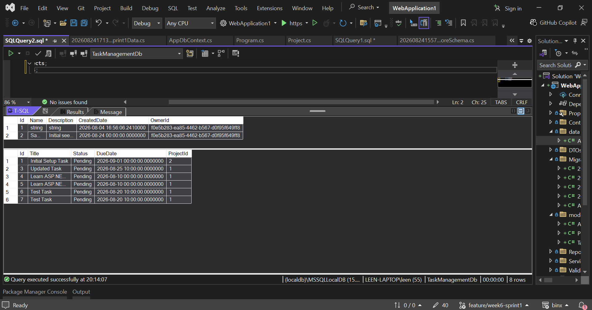

# Day 2 — EF Core Data Model & Migrations

Completed the EF Core database model and migration setup for the Task & Project Management API.

## What I Completed

* Created the core entities:

  * `Project`
  * `AppTask`
  * `TaskAssignment`
* Configured entity relationships using the EF Core Fluent API.
* Configured explicit delete behaviors.
* Connected `Project.OwnerId` and `TaskAssignment.UserId` to ASP.NET Core Identity users.
* Added initial seed data using `HasData`.
* Created and applied EF Core migrations.
* Preserved the existing project data and assigned it to the Admin user.
* Verified the updated database schema and seeded data in SQL Server.

## Database Changes

* Added `Project.OwnerId` linked to `AspNetUsers`.
* Updated `TaskAssignment.UserId` from `int` to `string`.
* Removed the old `Users` table.
* Added foreign keys between the project/task entities and Identity users.
* Added initial seeded Project and Task data.

## Seed Data

A sample project and task were added using EF Core `HasData`.

```text
Sample Project
    ↓
Initial Setup Task
```

The existing project was preserved and assigned to:

```text
admin@example.com
```

## Migration

Migration:

```text
Week6_Sprint1_CoreSchema
```

Seed migration:

```text
SeedSprint1Data
```

Both migrations were reviewed and successfully applied to SQL Server.

## Verification

The database was verified after applying the migrations.

* Existing Project preserved
* Seeded Project added
* Seeded Task added
* Project Owner correctly linked to `AspNetUsers`
* Existing Tasks preserved



