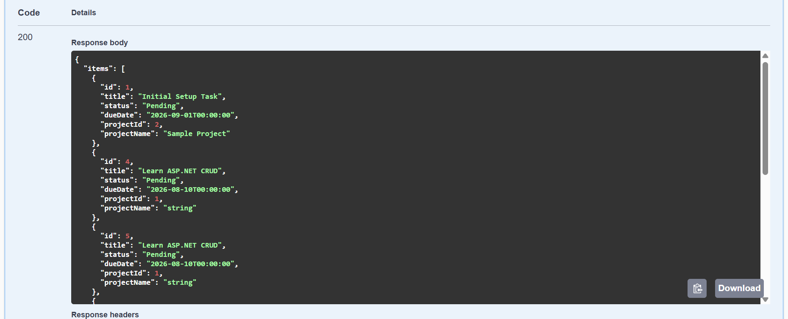
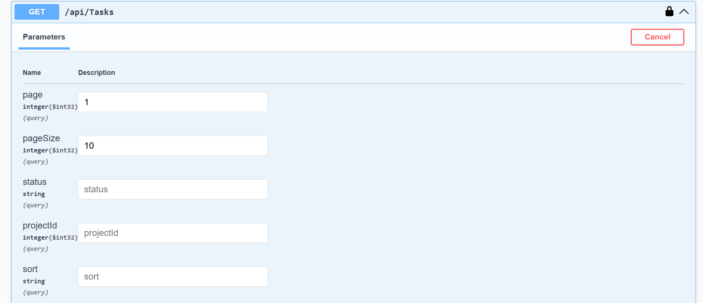
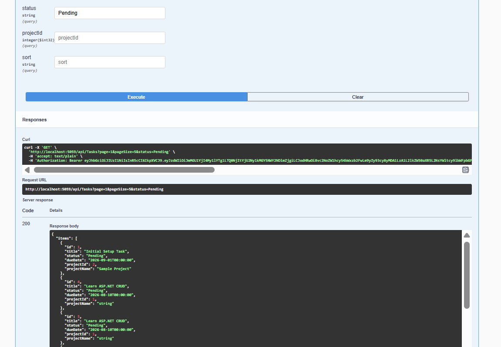
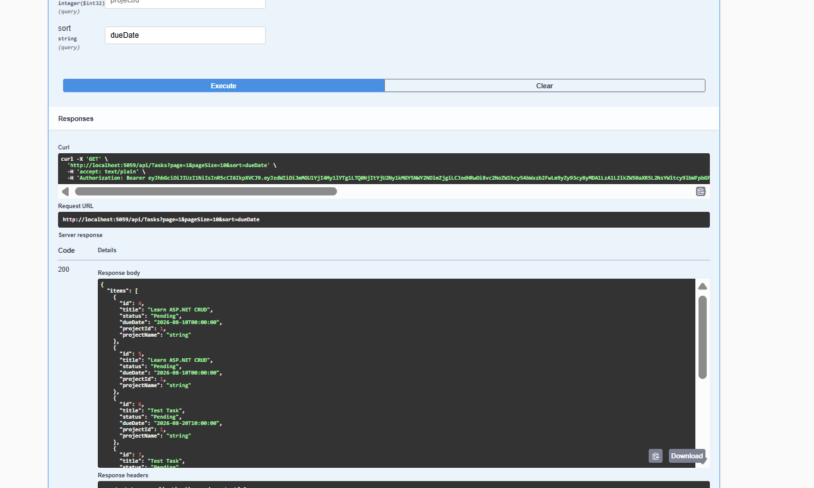
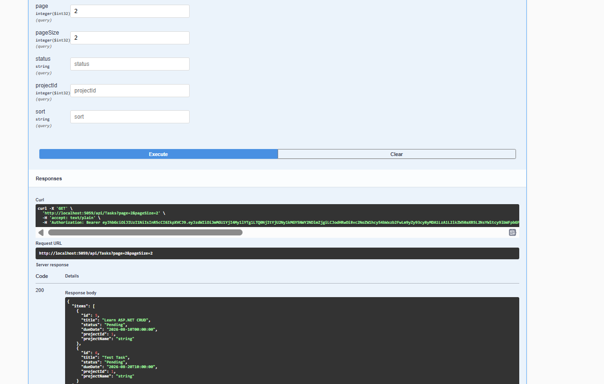

## Day 3 — Catalog & Read Operations

Enhanced the `GET /api/tasks` endpoint by adding pagination, filtering, sorting, and DTO projection.

### Features

* Pagination using `page` and `pageSize`
* Filtering by `status` and `projectId`
* Sorting by `title` or `dueDate`
* DTO projection using `TaskResponseDto`
* Paginated response using `PagedResult<T>`

### GET /api/tasks

Before updating the endpoint:



After adding pagination and DTO response:



### Filtering

```http
GET /api/tasks?status=Pending
```



### Pagination, Filtering & Sorting

```http
GET /api/tasks?page=1&pageSize=5&status=Pending&sort=dueDate
```



### Pagination Example

```http
GET /api/tasks?page=2&pageSize=2
```



All requests were tested through Swagger and returned `200 OK` with the expected data.

