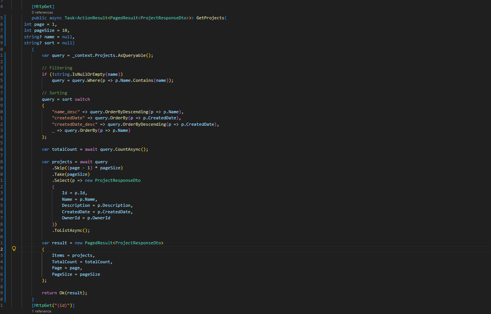
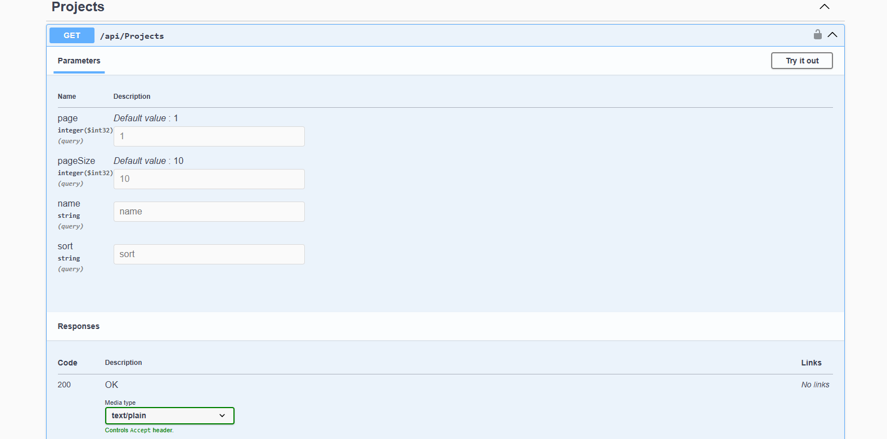
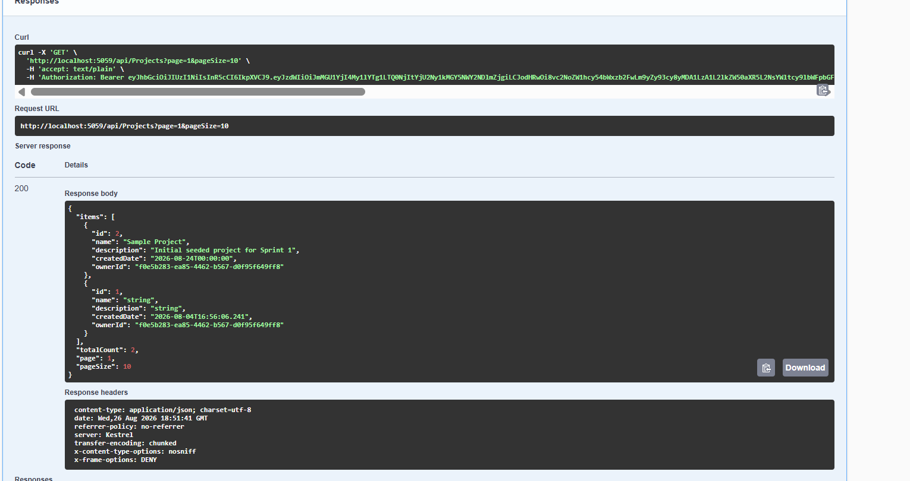
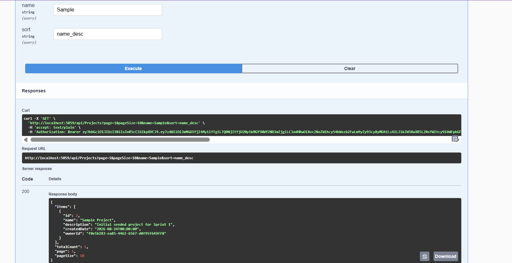

## Day 3 — Catalog & Read Operations

Enhanced the `GET /api/tasks` endpoint by adding pagination, filtering, sorting, and DTO projection.

### Features

* Pagination using `page` and `pageSize`
* Filtering by `status` and `projectId`
* Sorting by `title` or `dueDate`
* DTO projection using `TaskResponseDto`
* Paginated response using `PagedResult<T>`

### GET /api/tasks

Before updating the endpoint:


After adding pagination and DTO response:


### Filtering

```http
GET /api/tasks?status=Pending
```


### Pagination, Filtering & Sorting

```http
GET /api/tasks?page=1&pageSize=5&status=Pending&sort=dueDate
```


### Pagination Example

```http
GET /api/tasks?page=2&pageSize=2
```


All requests were tested through Swagger and returned `200 OK` with the expected data.
### GET /api/Projects

Enhanced the `GET /api/Projects` endpoint by adding pagination, filtering, sorting, and DTO projection, matching the same pattern used for `GET /api/tasks`.

#### Features

* Pagination using `page` and `pageSize`
* Filtering by `name`
* Sorting by `name` or `createdDate`
* DTO projection using `ProjectResponseDto`
* Paginated response using `PagedResult<T>`

Swagger view of the updated endpoint with the new query parameters:




#### Default Request

```http
GET /api/Projects?page=1&pageSize=10
```



#### Filtering & Sorting

```http
GET /api/Projects?page=1&pageSize=10&name=Sample&sort=name_desc
```



All requests were tested through Swagger and returned `200 OK` with the expected data.