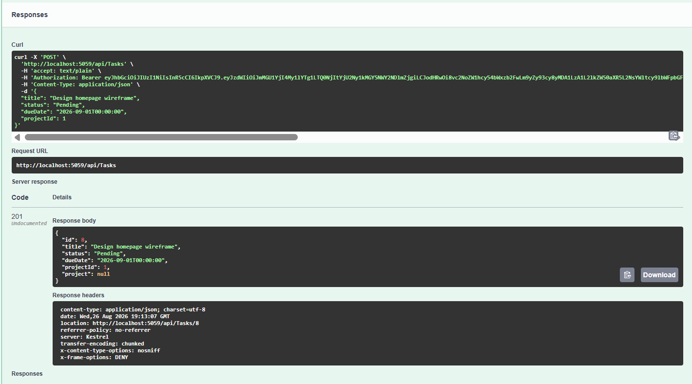
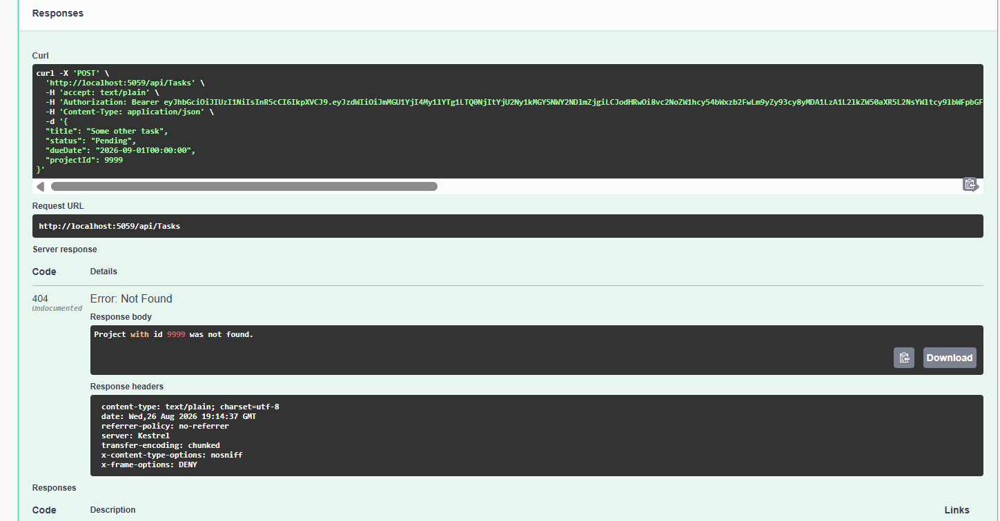
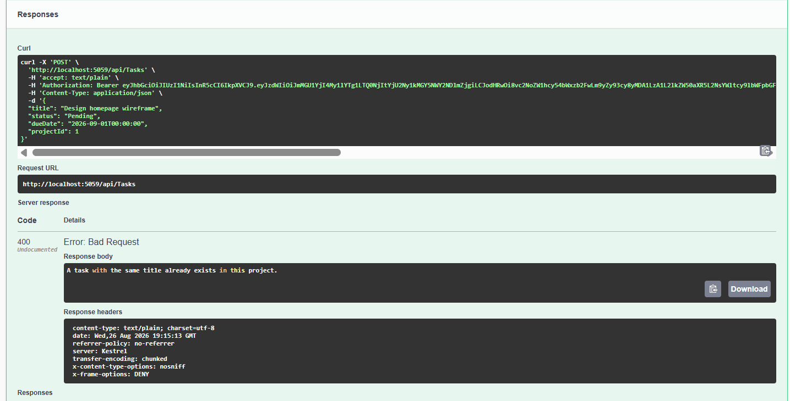

## Day 4 — Write Operations & Business Logic

Enhanced the `POST /api/tasks` endpoint by adding real business logic beyond simple field mapping, wrapped in a database transaction.

### Features

* Validates that the `ProjectId` exists before creating the task
* Prevents creating a task with a duplicate title within the same project
* Defaults `Status` to `Pending` when not provided
* Wraps the task creation in a database transaction using `BeginTransactionAsync`, `CommitAsync`, and `RollbackAsync`

### POST /api/tasks — Success

```http
POST /api/tasks
{
  "title": "Design homepage wireframe",
  "status": "Pending",
  "dueDate": "2026-09-01T00:00:00",
  "projectId": 1
}
```

Returns `201 Created` with the new task.



### Invalid ProjectId

```http
POST /api/tasks
{
  "projectId": 9999
}
```

Returns `404 Not Found` since the project does not exist.



### Duplicate Title

Sending the same title and projectId as an existing task returns `400 Bad Request`.



All requests were tested through Swagger and returned the expected status codes.


