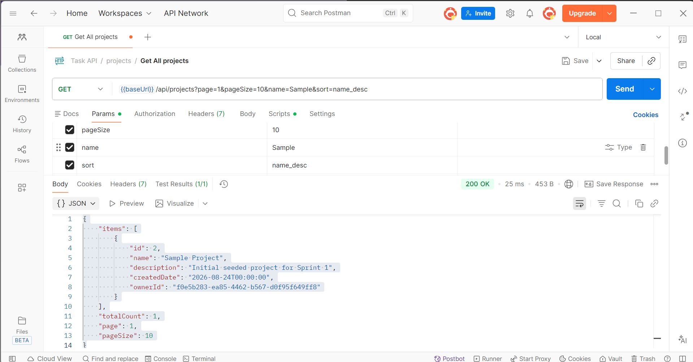
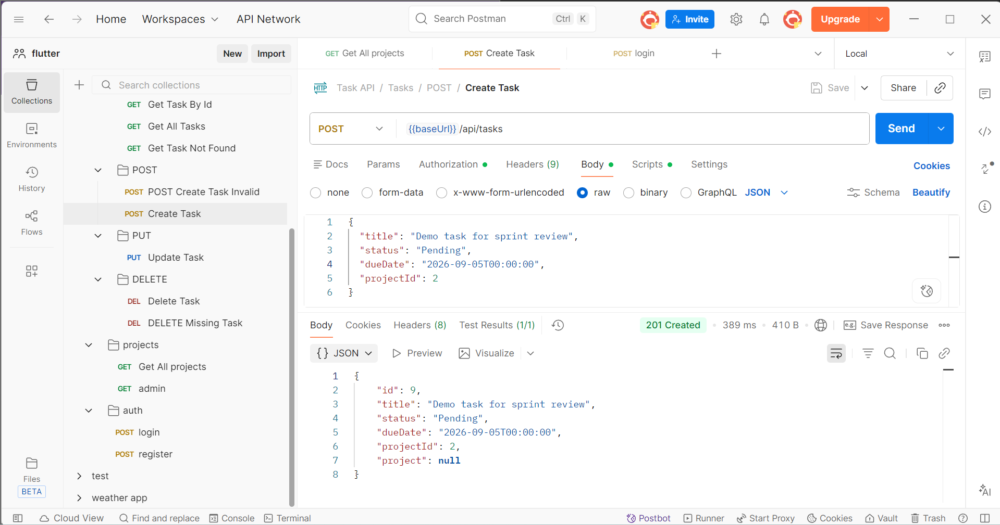
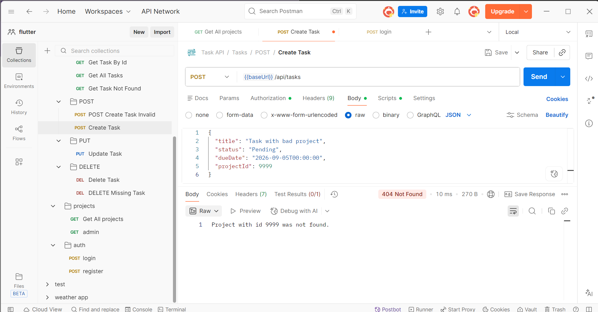
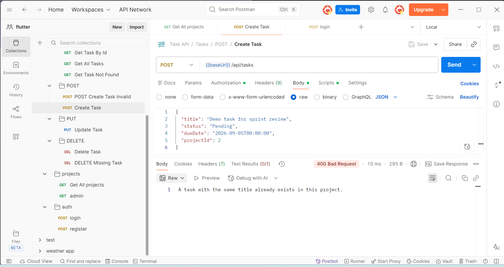

## Day 5 — Sprint Review, Postman Demo & Retrospective

Closed out Sprint 1 with a live Postman demo, a backlog review against acceptance criteria, and a written retrospective.

### Postman Demo

Demoed the two core Sprint 1 features using Postman against the running API.

#### Catalog Browsing — GET /api/Projects

```http
GET /api/Projects?page=1&pageSize=10&name=Sample&sort=name_desc
```

Returned `200 OK` with pagination, filtering by name, and sorting applied live.



#### Task Creation — POST /api/tasks

```http
POST /api/tasks
{
  "title": "Demo task for sprint review",
  "status": "Pending",
  "dueDate": "2026-09-05T00:00:00",
  "projectId": 2
}
```

Returned `201 Created` with the new task.



Invalid ProjectId returns `404 Not Found`:



Duplicate title in the same project returns `400 Bad Request`:



### Backlog Review

All Sprint 1 backlog tasks were checked against the acceptance criteria. Entity implementation, migrations, the paginated Projects and Tasks endpoints, task creation with business logic, and the pull request are complete and verified through Swagger and Postman.

One gap was found: automated xUnit tests were not written for the new GET /api/Projects filtering and the POST /api/tasks business logic. Both were only verified manually. This was logged as a Sprint 2 backlog item.

### Sprint 1 Retrospective

Completed all core Sprint 1 endpoints on schedule, matching the backlog plan from Day 1.

No automated tests were written for the new Sprint 1 endpoints, only manually verified via Swagger and Postman.

Action for Sprint 2: write the automated test for a new endpoint immediately after implementing it, before moving to the next backlog task.

### Sprint 1 Summary

Full ERD, migration history, and the merged pull request link are documented in Notion, ready for the mentor check-in.