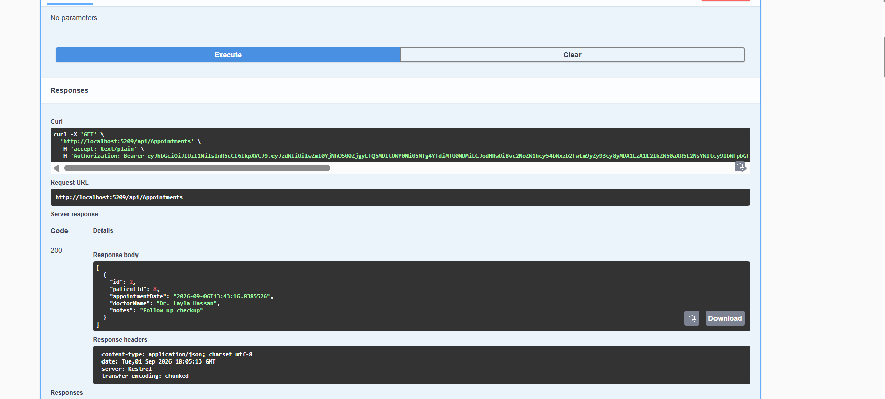
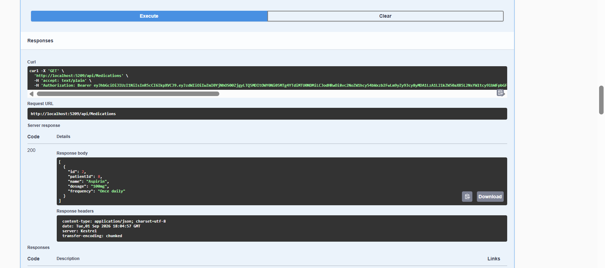
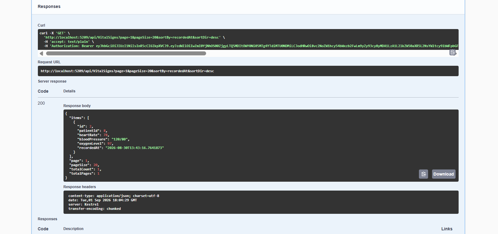
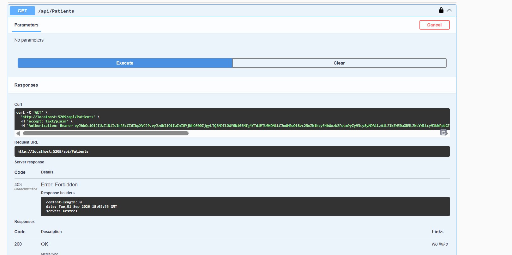
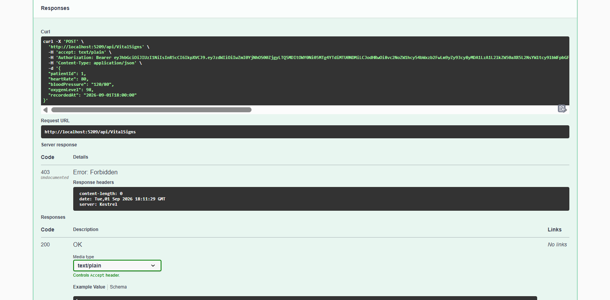
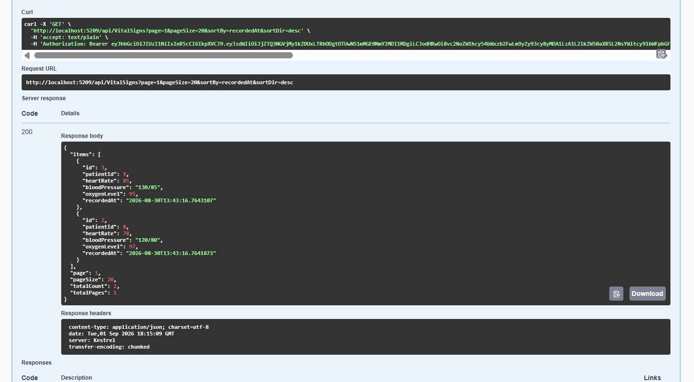

# Week 7 — Day 3

## Role-Based Access Control & Ownership Checks

Day 3 focused on securing the APIs using **Role-Based Access Control (RBAC)** and **Ownership Checks**.

The goal was to make sure that authenticated users can only access resources they are allowed to access, while Admin users have wider permissions.

---

# 1. Cardiac Patient Monitoring API

For the Cardiac project, authorization was applied to the main controllers:

* `VitalSignsController`
* `MedicationsController`
* `AppointmentsController`
* `PatientsController`
* `AlertsController`

## Ownership Checks

Patients can only access their own data.

The `PatientId` is taken from the JWT token and used to filter the requested resources.

Ownership checks were applied to:

* Vital Signs
* Medications
* Appointments
* Patient Profile

For example, a Patient can access their own vital signs but cannot access another patient's vital signs.

```csharp
var ownPatientId = User.FindFirstValue("PatientId");

query = query.Where(v => v.PatientId == parsedPatientId);
```

The JWT contains the user's role and `PatientId`, allowing the API to perform these ownership checks.

## Role-Based Access

Different endpoints require different roles.

For example:

```csharp
[Authorize(Roles = "Admin,Doctor")]
```

is used for operations such as creating vital signs.

Admin-only operations use:

```csharp
[Authorize(Roles = "Admin")]
```

The Alerts endpoint is restricted to Admin and Doctor:

```csharp
[Authorize(Roles = "Admin,Doctor")]
```

---

## Cardiac API Testing

The authorization rules were tested using Postman.

### Patient Access

A Patient was able to access their own appointments, medications, and vital signs.







### Patient Profile

The Patient can access their own profile.



### Ownership Check

A Patient attempting to access another patient's vital sign received `404 Not Found`.


### Admin-Only Endpoint

A Patient attempting to access an Admin-only endpoint received `403 Forbidden`.


### Restricted POST Operation

A Patient attempting to create a vital sign was rejected because the operation is restricted to Admin and Doctor.



### Doctor Access

A Doctor was able to access the vital signs endpoint successfully.



---

# 2. Task & Project Management API

The same security concepts were applied to the main **Task & Project Management API**.

## Role-Based Access Control

The API distinguishes between:

* **User**
* **Admin**

A newly registered user receives the `User` role, while an Admin account is seeded in the application.

Endpoints were reviewed and protected according to their required access level:

* Public endpoints
* Authenticated User endpoints
* Admin-only endpoints

---

## Project Ownership

Projects are protected using ownership checks.

A normal User can only access projects that belong to them.

The `OwnerId` is taken from the authenticated user's token instead of trusting a value supplied by the client.

Admins can access all projects.

### Create Project

When a User creates a project, the project ownership is associated with the authenticated user.


### Get Projects — User

A normal User receives only their own projects.


### Get Projects — Admin

An Admin can access all projects.


### Get Project by ID — Ownership Check

When a User attempts to access a project that belongs to another user, the API returns `404 Not Found`.


### Admin Endpoint

Admin-only endpoints reject normal Users.

A User attempting to access the Admin endpoint receives `403 Forbidden`.


---

## Task Ownership

The same ownership concept was applied to Tasks.

A User can access Tasks belonging to their own projects.

Before creating a Task, the API checks that the authenticated user owns the related Project.

Ownership checks are also applied when accessing individual Tasks.

This prevents users from accessing or creating Tasks under projects that they do not own.

---

## Task Management Testing

The following scenarios were tested:

| Test                                 | Result            |
| ------------------------------------ | ----------------- |
| Create Project — OwnerId from token  | ✅ Passed          |
| User gets only their projects        | ✅ Passed          |
| Admin gets all projects              | ✅ Passed          |
| User accesses another user's project | ✅ `404 Not Found` |
| User accesses another user's task    | ✅ Access rejected |
| User accesses Admin endpoint         | ✅ `403 Forbidden` |

These tests verify both **Role-Based Authorization** and **Resource Ownership**.

---

# Day 3 Summary

During Day 3, the APIs were secured using two main concepts.

### Role-Based Authorization

Different roles have different permissions.

For the Cardiac API:

```text
Admin
Doctor
Patient
```

For the Task Management API:

```text
Admin
User
```

### Ownership Checks

Authenticated users cannot access resources belonging to other users or patients.

The ownership validation adds an additional security layer beyond simply checking whether a user is logged in.

Overall, Day 3 focused on making both APIs more secure by combining:

* Authentication
* Role-Based Authorization
* Resource Ownership Validation
* Endpoint Access Testing

All major Day 3 authorization and ownership scenarios were tested successfully using Postman.
