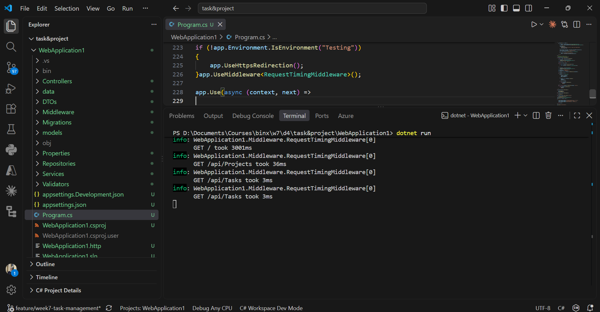
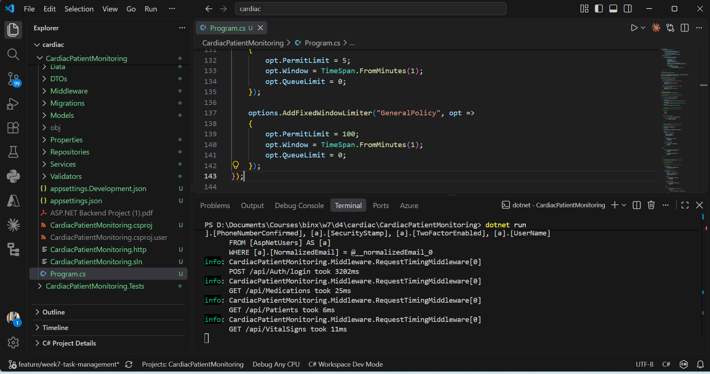

# Week 7 — Day 4: Custom Middleware & Mentor Review Preparation

Today focused on implementing a custom middleware and preparing both capstone projects for the upcoming mentor code review.

## Tasks Completed

* Identified **request timing and logging** as a cross-cutting concern.
* Implemented `RequestTimingMiddleware`.
* Added request timing logs for incoming API requests.
* Registered and tested the middleware in both projects.
* Verified the middleware output through the Terminal.
* Reviewed **role-based authorization** across the controllers.
* Reviewed **ownership checks** for patient-specific resources.
* Prepared the projects for a clean Pull Request and mentor review.

## Middleware

The custom `RequestTimingMiddleware` measures how long each HTTP request takes and logs:

* HTTP method
* Request path
* Execution time in milliseconds

This keeps the cross-cutting logging logic centralized instead of duplicating it across controllers.

## Testing

The middleware was tested successfully in both capstone projects.

### Task & Project Management API

### Cardiac Patient Monitoring API

The Terminal output confirms that the middleware is being executed successfully and logging the request duration.

## Authorization Review

The controllers were reviewed to ensure that:

* Role-based authorization is applied correctly.
* `Admin`, `Doctor`, and `Patient` permissions are enforced.
* Ownership checks are applied to patient-specific resources.
* Patients cannot access another patient's resources.

## Day 4 Outcome

✅ Custom middleware implemented
✅ Request timing tested successfully
✅ Authorization reviewed
✅ Ownership checks reviewed
✅ Projects prepared for mentor code review
⏳ Pull Request submission and mentor feedback
