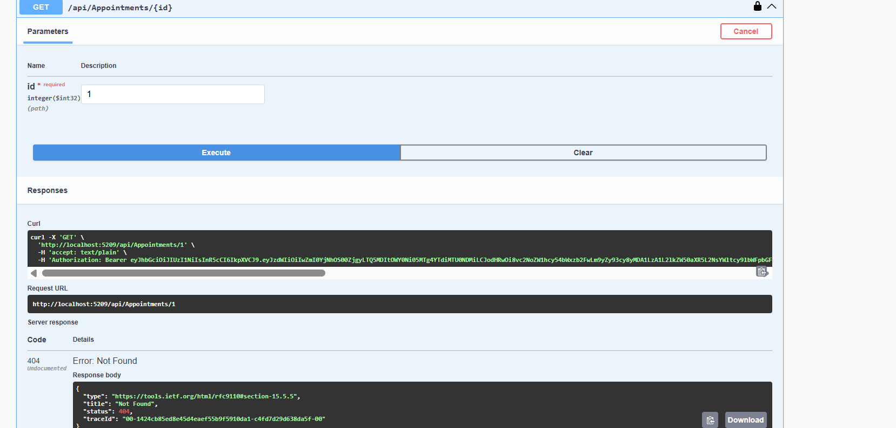
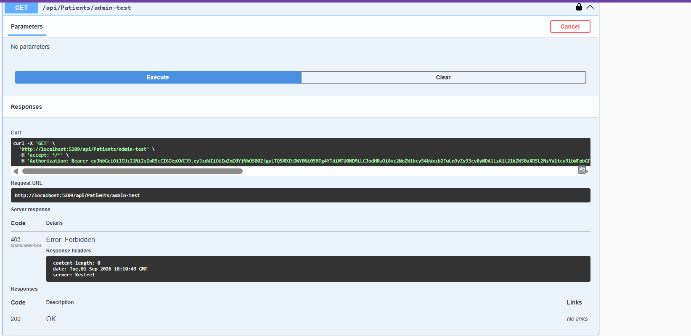

# Week 7 — Day 5: Sprint Review & Retrospective

## Sprint 2 — Authentication & Role-Based Access

Day 5 focused on reviewing the work completed during Sprint 2, demonstrating the APIs using Postman, and reflecting on the development process.

---

# 1. Sprint Review

During this sprint, I worked on securing both capstone APIs.

### Cardiac Patient Monitoring API

* Implemented Identity and JWT authentication.
* Added `Admin`, `Doctor`, and `Patient` roles.
* Applied role-based authorization.
* Added ownership checks for patient resources.

### Task & Project Management API

* Continued Identity and JWT integration.
* Defined `Admin` and `User` roles.
* Applied role-based authorization.
* Added ownership checks for Projects and Tasks.

---

# 2. Postman Demo

The implemented authorization rules were tested using Postman.

### Cardiac API

Patients can access their own resources.

Patients cannot access another patient's resources.

Admin-only endpoints reject unauthorized users.

### Task Management API

Users can access their own projects, while Admins can access all projects.

Users cannot access another user's project.

These tests verified both successful access and rejected unauthorized requests.

---

# 3. Sprint Retrospective

### What went well?

* Identity and JWT authentication were implemented.
* Roles and ownership checks were applied.
* Authorization was tested using Postman.
* The Pull Request was prepared for mentor review.

### What was challenging?

* Integrating Identity with the existing database.
* Applying ownership checks consistently.
* Testing different roles and access scenarios.

### What did I learn?

I learned how to integrate Identity, use JWT claims, apply RBAC, implement ownership checks, and test protected endpoints.

### What can be improved?

* Add more automated authorization tests.
* Improve consistency across controllers.
* Apply mentor feedback before the next sprint.

### Action Item for Sprint 3

**Write an ownership-check test for every new resource endpoint.**

---

# 4. Summary

Sprint 2 established a stronger security foundation for both APIs through authentication, authorization, ownership checks, and custom middleware.

**Status:** ✅ Completed

**Next Step:** Sprint 3 — Advanced Queries, Redis Caching, and Performance Tuning.
