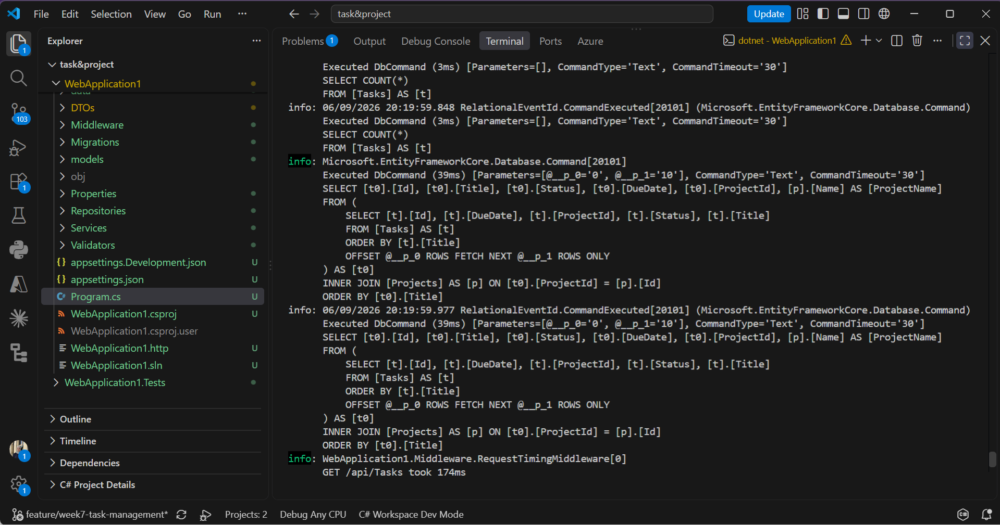
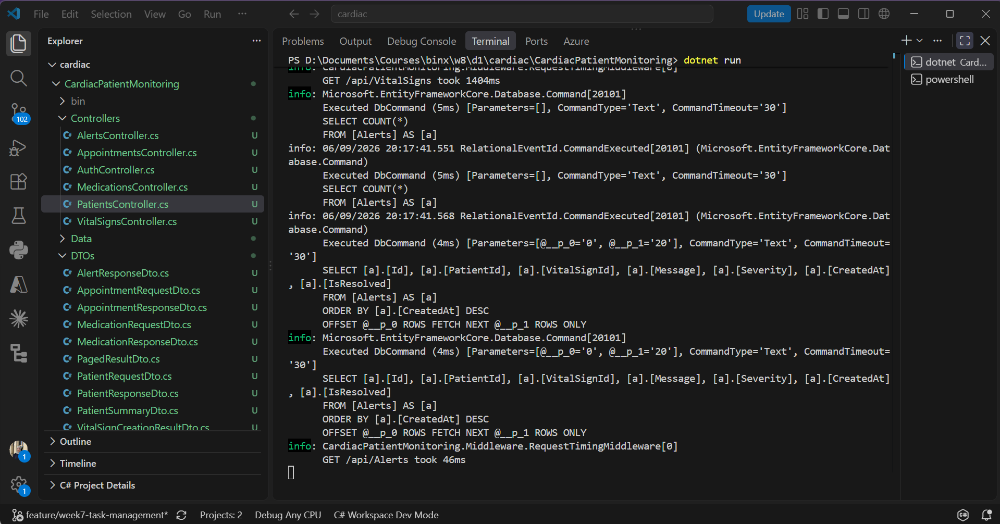
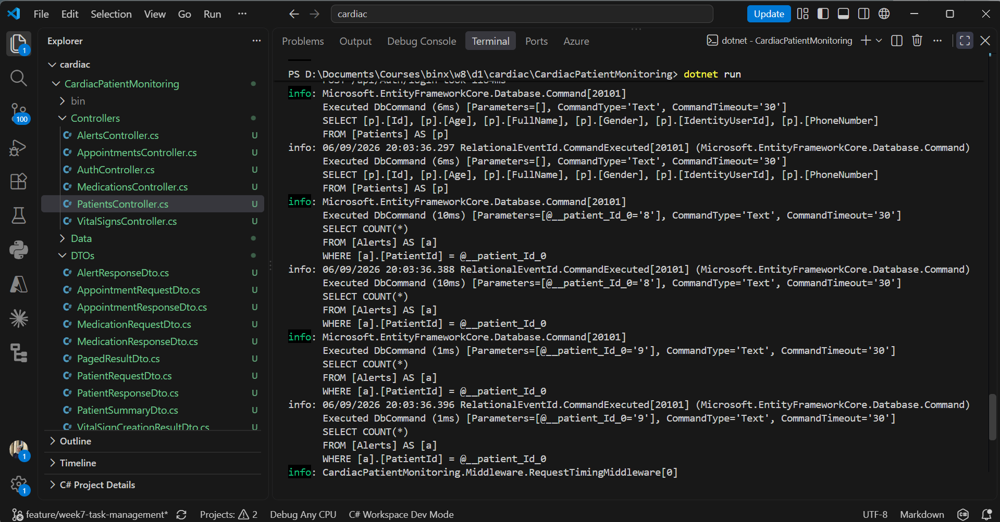

# Day 1 - Sprint 3 Planning and N+1 Diagnosis

## Sprint 3 Goal
Reduce query count on the two summary endpoints from 21-25 queries down to 1-2 queries per project using GroupBy or projection instead of a loop
Sprint 2 retrospective action item carried into this sprint is adding a second 403 test per project for admin only endpoints

## Setup
EF Core query logging was enabled on both capstone projects to see the actual SQL being generated instead of guessing. Each project was seeded with realistic test data so query counts would reflect real usage instead of a handful of test rows. The Task and Project Management API now has 24 projects and around 100 tasks. The Cardiac Patient Monitoring API now has 20 patients with vital signs alerts medications and appointments.

## Checking Existing Endpoints
GET api tasks and GET api projects in the Task and Project Management API were checked and both are clean with only 2 queries each a count query and a single paginated query with a join

GET api vitalsigns and GET api alerts in the Cardiac Patient Monitoring API were checked and both are clean with only 2 queries each following the same pattern

## Diagnosing N+1
A new summary endpoint was added to each project to intentionally demonstrate the N+1 problem. In the Task and Project Management API the endpoint GET api projects summary loads all projects and then counts the tasks for each project separately inside a loop. This produced 25 total queries and took 202ms for only 24 projects.

The same pattern was applied to the Cardiac Patient Monitoring API. The endpoint GET api patients summary loads all patients and then counts the alerts for each patient separately inside a loop. This produced 21 total queries and took 253ms for only 20 patients.

## Backlog Task
N+1 query problem found in GET api projects summary and GET api patients summary
Loading all records then counting related records separately for each one inside a foreach loop caused 21 to 25 total queries per endpoint instead of 1 or 2
Planned fix for Day 2 is to replace the loop in both endpoints with a single grouped query using GroupBy or a projection with Select and Count