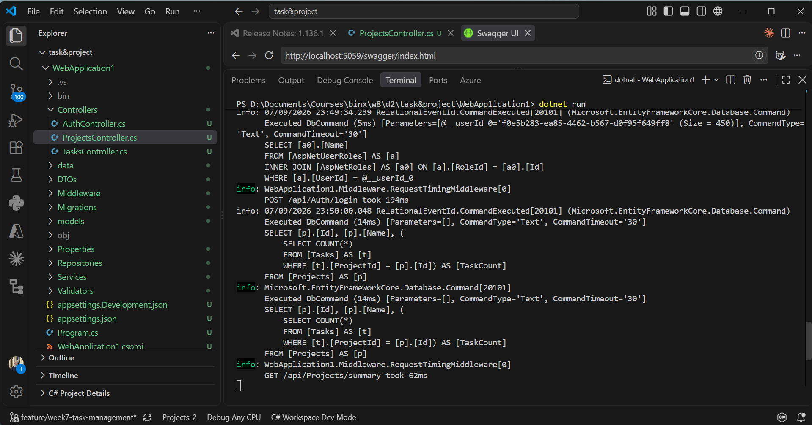
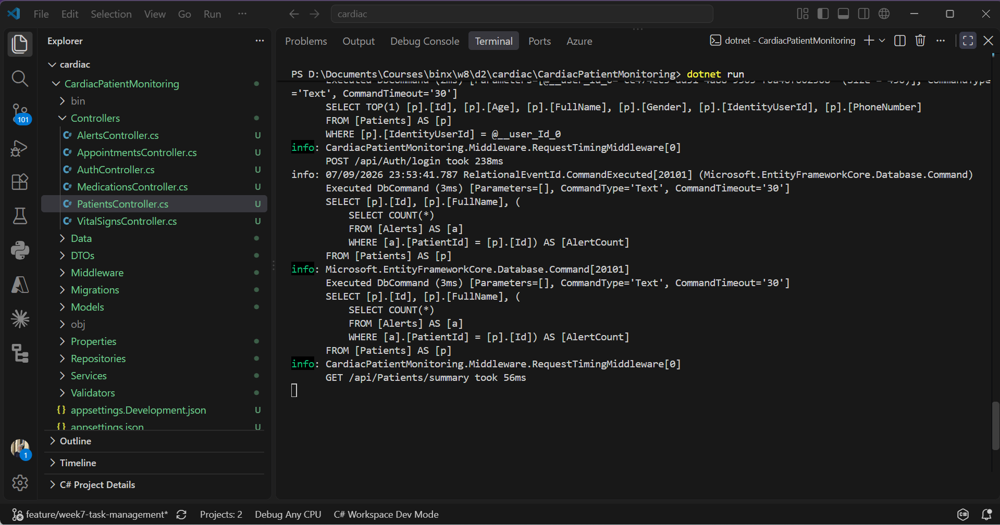

# Day 2 - Query Optimization with Eager and Explicit Loading

## Goal
Fix the N+1 problems diagnosed on Day 1 by replacing the per record loops with a single query using projection, and measure the actual improvement instead of assuming it worked

## Fixing the Task and Project Management API
The GET api projects summary endpoint was changed from a loop that queried the task count for each project separately into a single projection query that computes the count as a subquery inside the same select. This dropped the query count from 25 down to 1 and the response time down to 62ms

## Fixing the Cardiac Patient Monitoring API
The same projection fix was applied to the GET api patients summary endpoint, replacing the per patient alert count loop with a single query using a subquery for the count. This dropped the query count from 21 down to 1 and the response time down to 56ms

## Converting Include to Projection
The GET api tasks endpoint in the Task and Project Management API was using Include to load the full related project entity even though it only needed the project owner id for ownership filtering and the project name for the response. It was converted to a plain projection that selects only the fields it actually needs instead of loading the entire project entity through a join. Response time after the change was 90ms

The Cardiac Patient Monitoring API's other endpoints already used projection instead of Include from the start, so there was no Include to convert there. AsSplitQuery did not apply to either project since no endpoint loads two or more collection navigation properties together

## Verification
All fixes were verified using EF Core query logging with the same seeded data volume from Day 1, confirming the query counts collapsed from N+1 down to a single query on both endpoints

## Next
Day 3 introduces Redis caching on a high read endpoint using the cache aside pattern