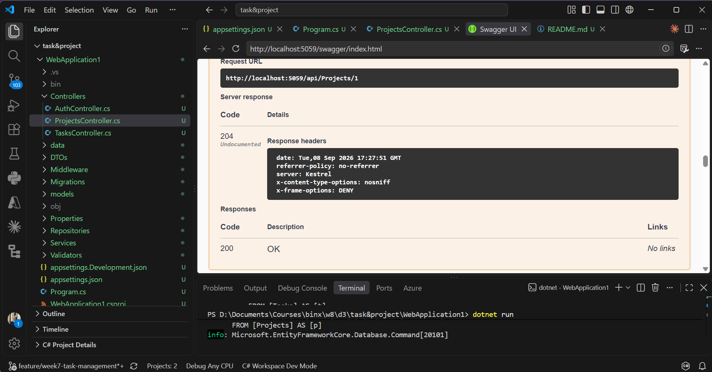
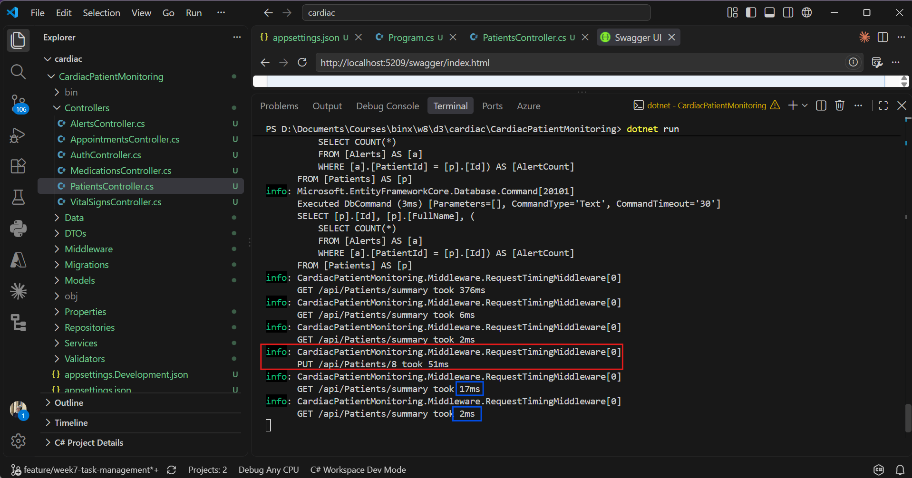

# Week 8 — Day 3: Redis Caching

Day 3 focused on adding **Redis Caching** to both capstone APIs using `IDistributedCache`.

## Goals

* Configure Redis with Docker.
* Implement the **Cache-Aside Pattern**.
* Reduce unnecessary database queries.
* Add cache expiration and invalidation.

## Task & Project Management API

Cached endpoint:

```text
GET /api/Projects/summary
```

The first request gets data from the database and stores it in Redis.
Subsequent requests are served from the cache.


Project updates invalidate the summary cache.




## Cardiac Patient Monitoring API

Cached endpoint:

```text
GET /api/Patients/summary
```

The patient summary is cached for **10 minutes**.


Patient create, update, and delete operations invalidate the cache.



## Redis Configuration

```json
"Redis": "localhost:6379"
```

Redis was registered using:

```csharp
builder.Services.AddStackExchangeRedisCache(options =>
{
    options.Configuration =
        builder.Configuration.GetConnectionString("Redis");
});
```

## Result

Redis caching was successfully implemented and tested in both APIs.

* **Cache Hit** → Data returned from Redis.
* **Cache Miss** → Data loaded from the database and cached.
* **Cache Invalidation** → Cache removed after data changes.
