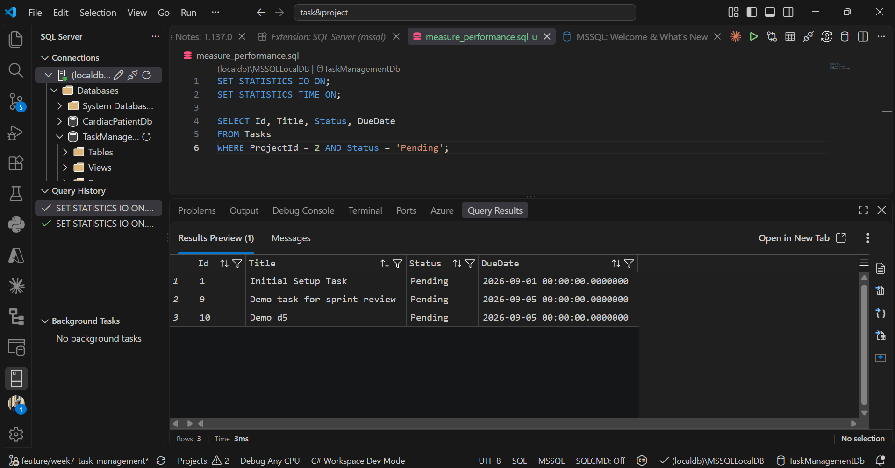
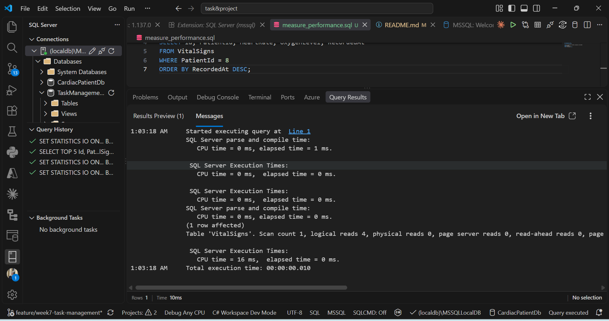

# Week 8 — Day 4: Database Indexing & Performance Profiling

Day 4 focused on database indexing and performance profiling for both capstone projects. After reviewing the main queries, I added the necessary indexes through Fluent API and created a new migration.

For the Task API, I added an index on `Project.OwnerId`, and composite indexes on `Tasks(ProjectId, Status)` and `Tasks(ProjectId, Title)`. These indexes support the filtering and duplicate-title checks used in the main endpoints.

For the Cardiac API, I added composite indexes on `VitalSigns(PatientId, RecordedAt)`, `Alerts(PatientId, CreatedAt)`, and `Alerts(PatientId, IsResolved)`. These indexes support the filtering and sorting used in the main queries.

I installed the SQL Server extension in VS Code and connected to the local LocalDB instance. I used `STATISTICS IO` and `STATISTICS TIME` to measure logical reads and execution time.

For the Task API, querying tasks filtered by `ProjectId` and `Status` returned **4 logical reads** with a total execution time of **3ms**.

For the Cardiac API, querying vital signs filtered by `PatientId` and sorted by `RecordedAt` returned **4 logical reads** with a total execution time of **10ms**.

These results show that the composite indexes were used efficiently for the tested queries.
