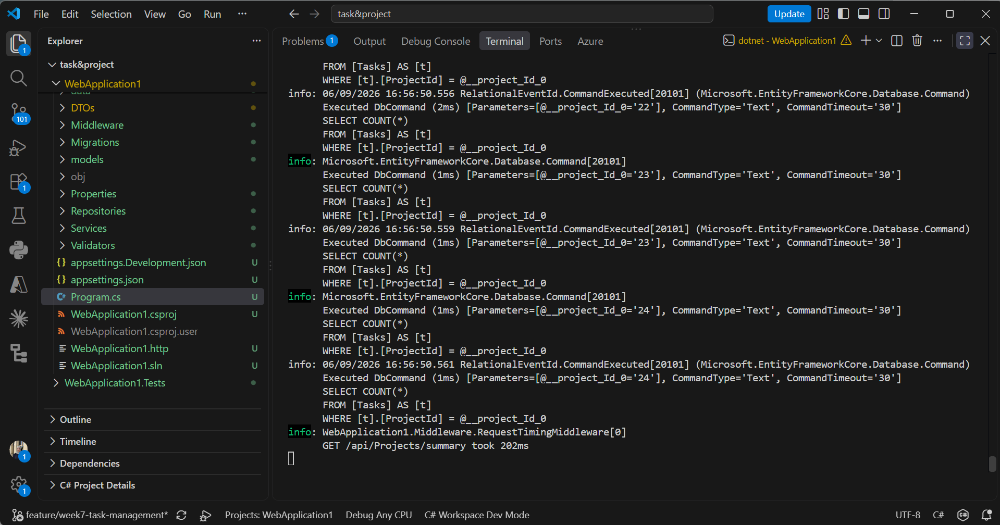
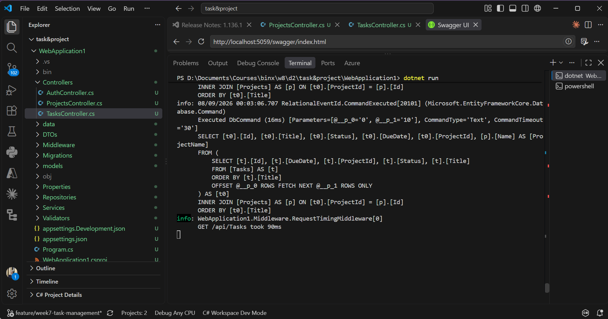
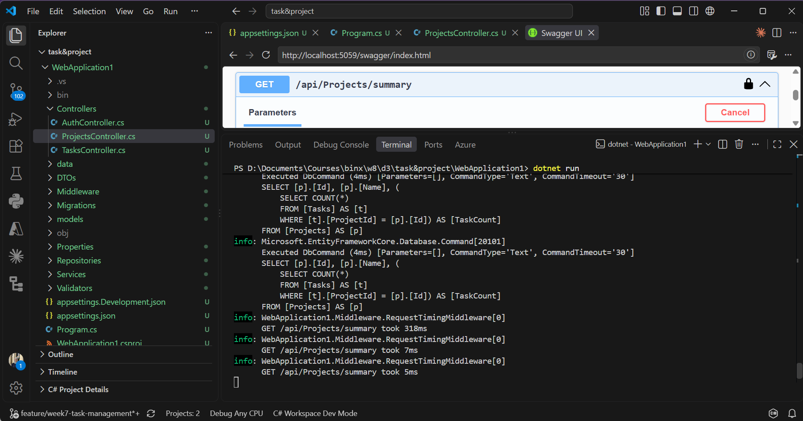
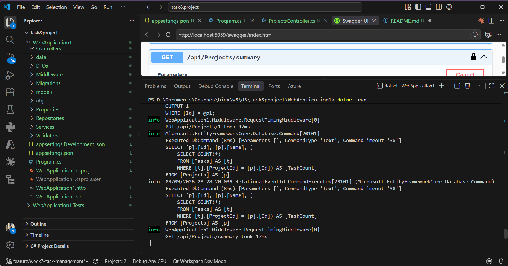
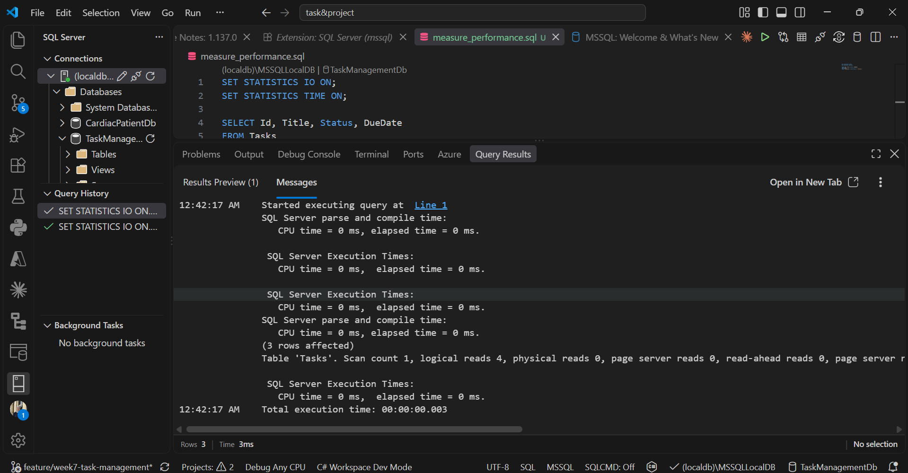
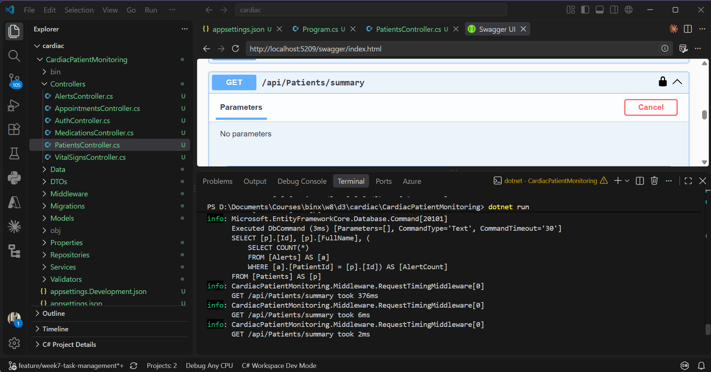
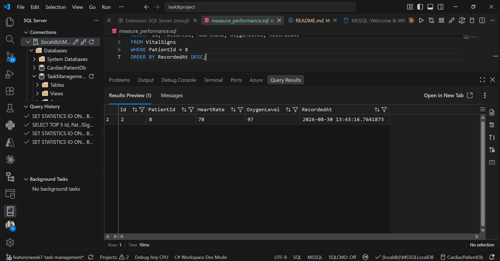

# Week 8 Day 5: Sprint Review, Benchmark Demo & Retrospective

Day 5 closed out Sprint 3 with a benchmark demo, a structured sprint review against the acceptance criteria, and a written retrospective for Sprint 4.

## Benchmark Demo

The demo presented real before and after numbers for both capstone projects instead of impressions.

**Task & Project Management API**

The N+1 fix on `GET /api/projects/summary` dropped the query count from 25 to 1 and cut the response time from 202ms to 62ms.

`GET /api/tasks` came down to 90ms after the Include to projection conversion.

Redis caching on the same summary endpoint now serves repeat reads from cache instead of hitting the database, with the update path correctly invalidating that cache.

The composite index on `Tasks(ProjectId, Status)` brought a filtered query down to 4 logical reads at 3ms.

**Cardiac Patient Monitoring API**

The N+1 fix on `GET /api/patients/summary` dropped the query count from 21 to 1 and cut the response time from 253ms to 56ms.

Redis caching on the same endpoint holds results for 10 minutes and is invalidated on patient create, update, and delete.

The composite index on `VitalSigns(PatientId, RecordedAt)` brought a filtered and sorted query down to 4 logical reads at 10ms.

## Sprint Review

Each Sprint 3 task was checked against its stated target rather than just marked done. The N+1 diagnosis and fix, the Redis caching with cache-aside, and the composite indexing were all completed and measured with before and after evidence on both projects. Cache invalidation was not just implemented but actually tested, with create, update, and delete operations confirmed to clear the cached summary correctly on both APIs.

One process gap came out of the review: all five days of Sprint 3 were committed directly to a branch that was still named after Week 7 and merged straight into main, instead of going through a dedicated Sprint 3 branch and pull request. The code and folder structure on main are correct and complete, but the pull request step itself was skipped.

## Iteration Backlog

The following items are logged for Sprint 4 rather than being treated as finished:

- Open dedicated feature branches and pull requests per sprint going forward, instead of committing directly to main.
- Extend the Redis caching strategy to additional high-read endpoints beyond the two summary endpoints.

## Sprint 3 Retrospective

**What went well:** The N+1 problem was diagnosed with real query logging instead of guessing, and the fix using projection instead of Include brought both summary endpoints down to a single query. Redis caching with the cache-aside pattern worked cleanly on both projects, and invalidation was verified by hand instead of assumed to work.

**What to improve:** Sprint 3's work was committed straight to main under a mislabeled branch name instead of a proper feature branch with a pull request, which made the history harder to follow.

**Action for Sprint 4:** Add a regression test asserting that `GET /api/projects/summary` and `GET /api/patients/summary` each execute exactly 1 query, so a future change cannot silently reintroduce an N+1 problem without a test failing.