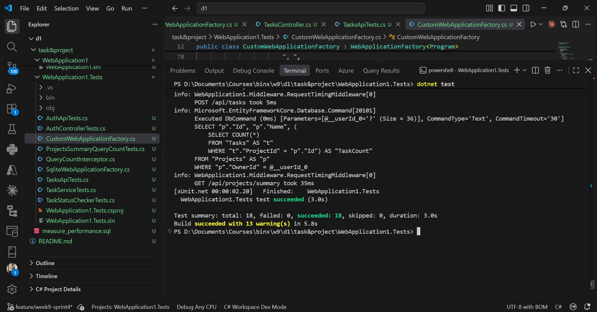
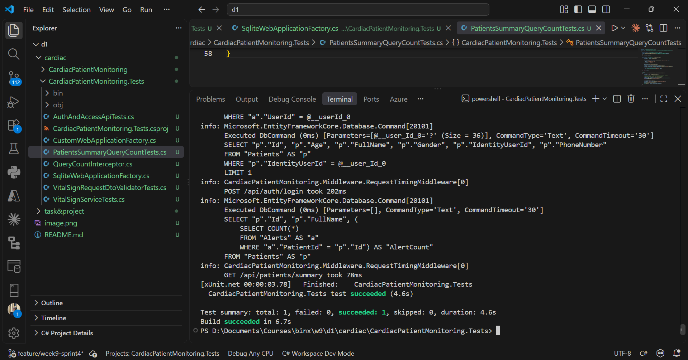
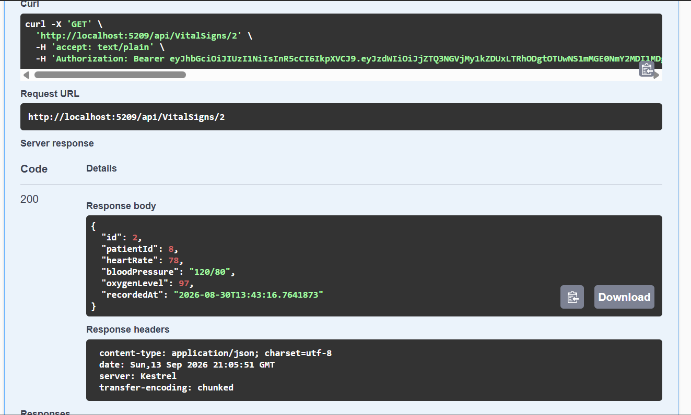
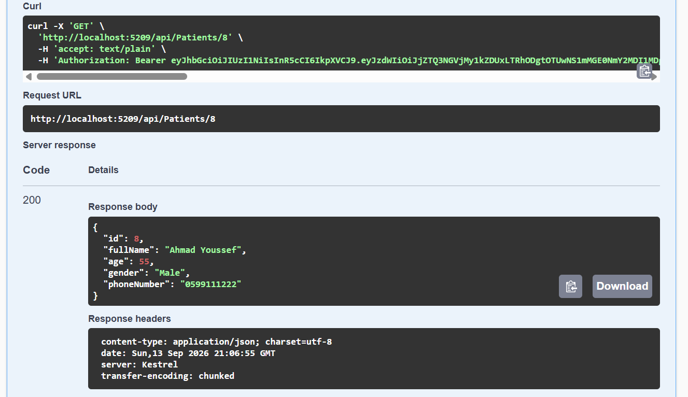
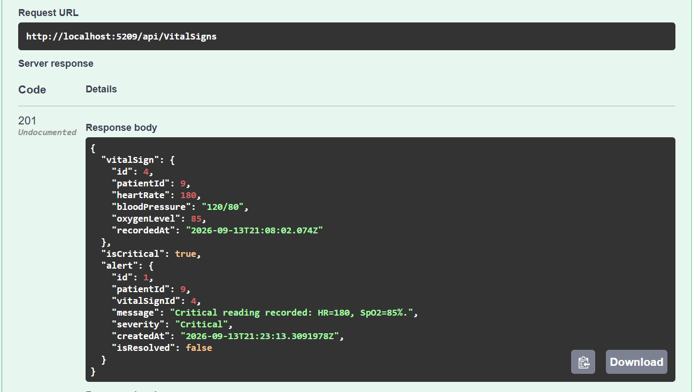
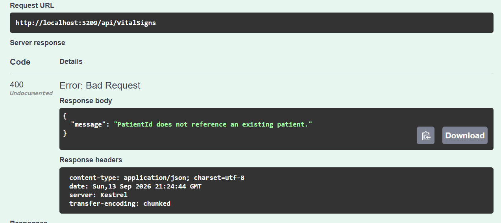

# Sprint 4: Test Coverage

## Sprint Goal

Improve API test coverage by finding missing tests and covering the highest-risk endpoints.

## Sprint Backlog

* Audit all API endpoints.
* Identify happy-path and error-path gaps.
* Prioritize authentication, authorization, and critical patient operations.
* Add tests for the highest-priority gaps.
* Run the full test suite.

## Endpoint Coverage

| Area                   | Coverage   |
| ---------------------- | ---------- |
| Authentication         | Both       |
| Authorization          | Both       |
| Tasks                  | Both       |
| Vital Signs            | Both       |
| Patients               | Happy Path |
| Validation             | Both       |
| Performance Regression | Covered    |

## High-Priority Tests

### Authentication & Authorization

Tests cover unauthorized access, valid login, admin access, and forbidden access for normal users.

### Task API



### Cardiac API



### Get Vital Sign by ID



### Get Patient by ID



### Add Vital Sign — Existing Patient



### Add Vital Sign — Non-existing Patient



## Sprint 3 Retrospective Action

Performance regression tests were kept to ensure optimized endpoints continue to execute efficiently.

## Final Verification

The full test suite was run using:

```bash
dotnet test
```

All tests passed successfully with **0 failed tests**.
