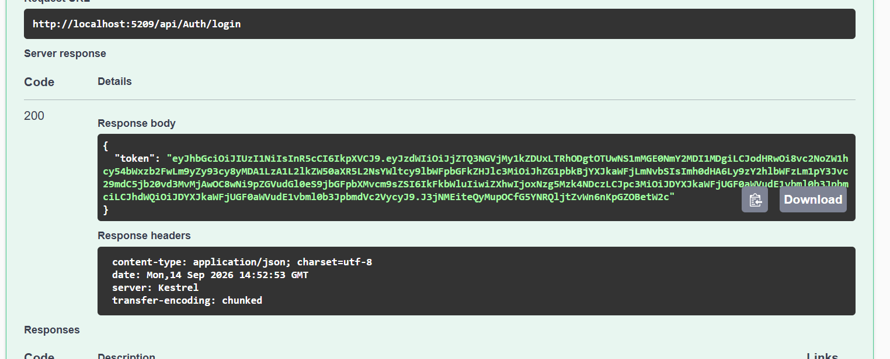
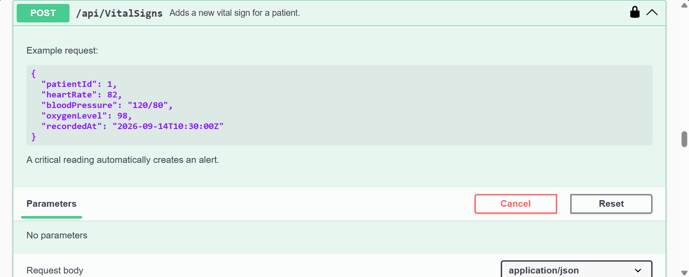
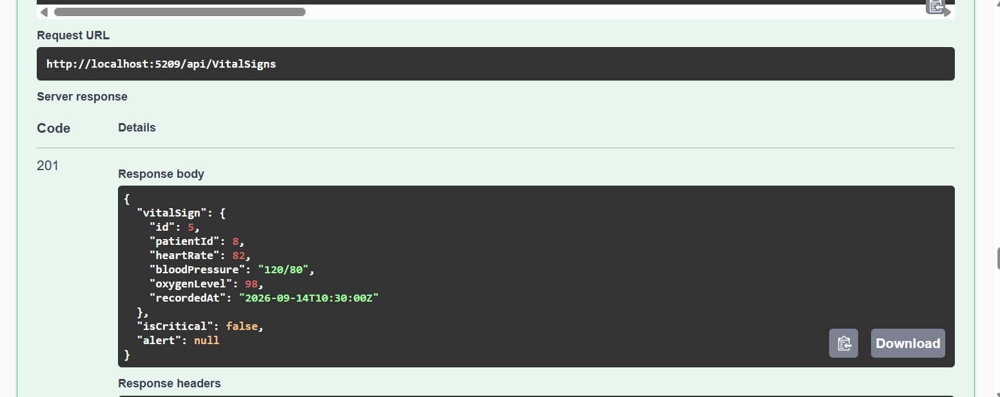
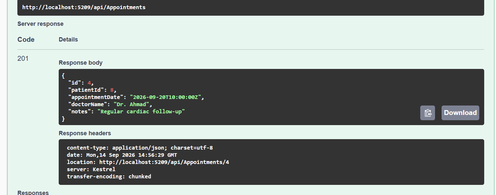
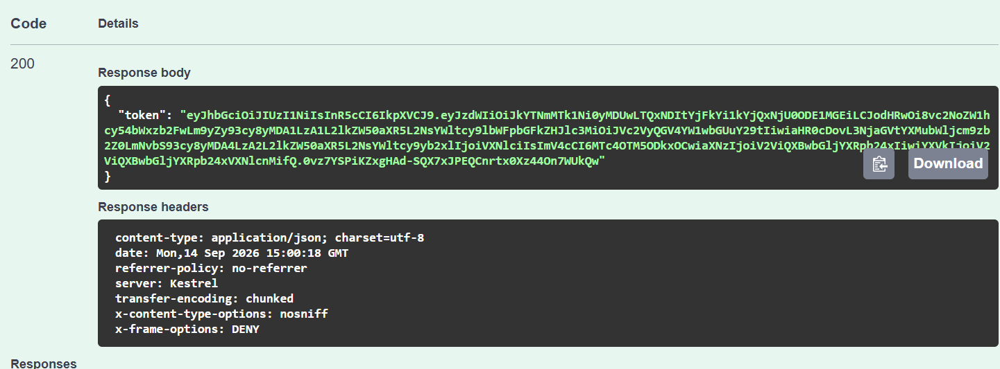
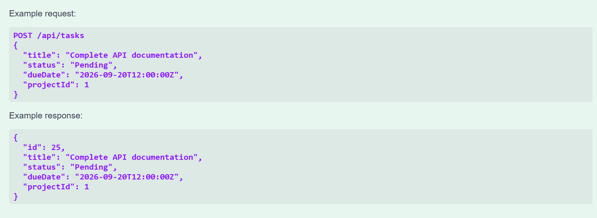
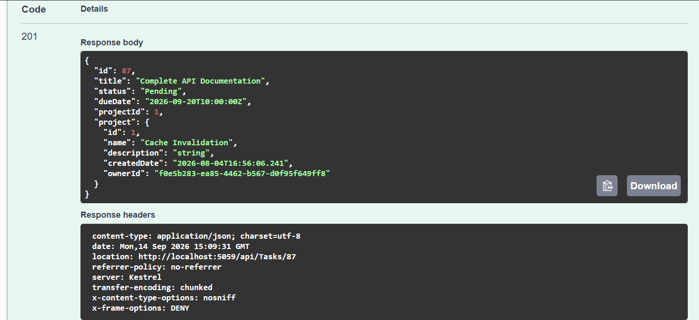

# Day 2 — API Documentation & Testing

Today, Swagger API documentation was reviewed and tested for both projects. The main endpoints were executed successfully using realistic requests and responses.

## Cardiac Patient Monitoring API

### Login

Tested the login endpoint using Swagger.

### Example POST Request

An example POST request was tested through Swagger.

### Add Vital Sign

A new vital sign was added for an existing patient.

### Add Appointment

A new appointment was added successfully.

---

## Task Management API

### Login

Tested the authentication endpoint using Swagger.

### POST Task Example

The Swagger request body and example for creating a task were reviewed.

### Add Task

A new task was created successfully using the API.

---

## Summary

* Tested authentication with Swagger.
* Tested POST endpoints for both projects.
* Added Vital Signs and Appointments in the Cardiac API.
* Added Tasks in the Task Management API.
* Verified request and response examples.
