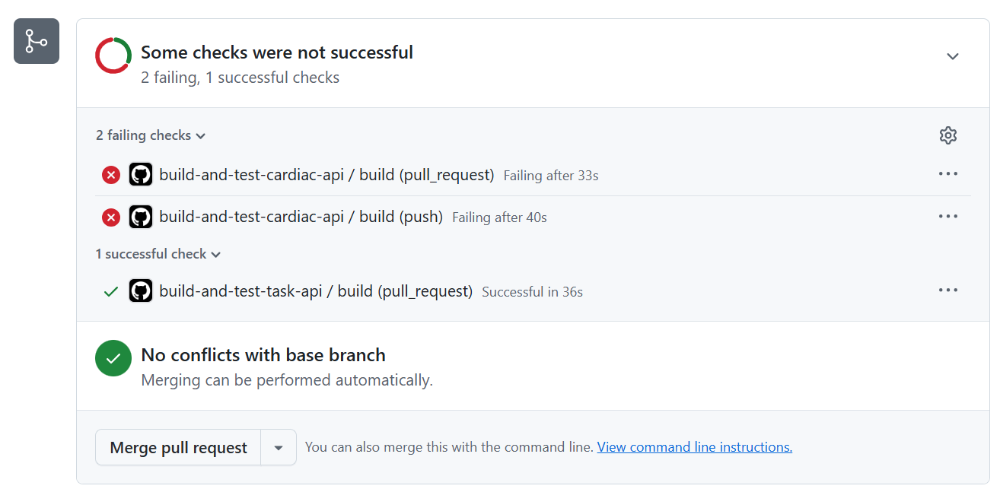
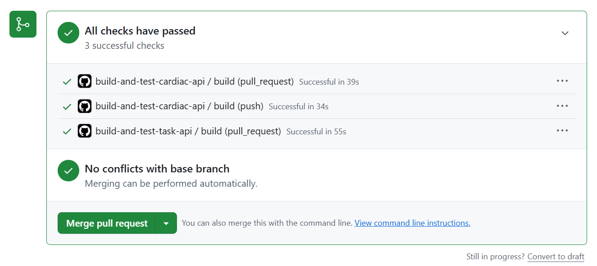

# Day 3 — CI/CD Pipeline with GitHub Actions

## Overview

Implemented CI/CD pipelines using GitHub Actions for both APIs.

The pipelines automatically:

* Checkout the code
* Setup .NET 9
* Restore dependencies
* Build the project
* Run automated tests
* Start Redis for tests that require caching

## Cardiac API — CI Failure Test

A test was intentionally changed to make the pipeline fail.
This confirmed that the CI pipeline correctly detects test failures.

## Cardiac API — Successful CI

After fixing the failing test, the Cardiac API pipeline passed successfully.

## Task API — Successful CI

The Task API pipeline also completed successfully with all required build and test steps.

## Result

Both APIs now have working GitHub Actions CI pipelines that automatically build and test the projects on push and pull requests.
